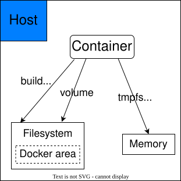

# 简介

在生产环境中使用 Docker，往往需要对数据进行持久化，或者需要在多个容器之间进行数据共享，这必然涉及容器的数据管理操作。而数据卷的生存周期独立于容器，容器消亡，数据卷不会消亡。因此，使用数据卷后，容器删除或者重新运行之后，数据却不会丢失，因此可以满足数据持久化的需求。

数据卷示意图如下：

容器中的管理数据支持以下方式：

- 数据卷（Data Volumes）：容器内数据直接映射到本地主机环境；
- 数据卷容器（Data Volume Containers）：使用特定容器维护数据卷。
