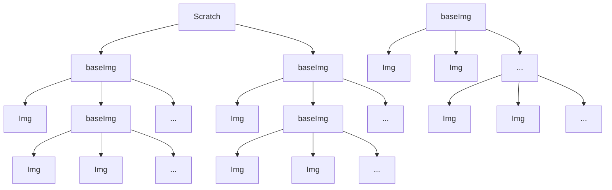

# 构建镜像

编写完成Dockerfile之后，可以通过`docker [image] build`命令来创建镜像。

其格式为：

```bash
docker build [选项] <上下文路径/URL/->
```

该命令将读取指定路径下（包括子目录）的Dockerfile，并将该路径下所有数据作为上下文（Context）发送给Docker服务端。Docker服务端在校验Dockerfile格式通过后，逐条执行其中定义的指令，碰到ADD、COPY和RUN指令会生成一层新的镜像。最终如果创建镜像成功，会返回最终镜像的ID。

> 如果上下文过大，会导致发送大量数据给服务端，延缓创建过程。因此除非是生成镜像所必需的文件，不然不要放到上下文路径下。如果使用非上下文路径下的Dockerfile，可以通过-f选项来指定其路径。
>

要指定生成镜像的标签信息，可以通过-t选项。该选项可以重复使用多次为镜像一次添加多个名称。

例如，上下文路径为/tmp/docker_builder/，并且希望生成镜像标签为builder/first_image:1.0.0，可以使用下面的命令：

```
$ docker build -t builder/first_image:1.0.0 /tmp/docker_builder/
```

## 命令选项

`docker [image] build`命令支持一系列的选项，可以调整创建镜像过程的行为，参见表。

```sh
$ docker build -h
Flag shorthand -h has been deprecated, use --help
Start a build

Usage:  docker buildx build [OPTIONS] PATH | URL | -

Start a build

Aliases:
  docker build, docker builder build, docker image build, docker buildx b

Options:
      --add-host strings              Add a custom host-to-IP mapping
                                      (format: "host:ip")
      --allow stringArray             Allow extra privileged entitlement
                                      (e.g., "network.host",
                                      "security.insecure")
      --annotation stringArray        Add annotation to the image
      --attest stringArray            Attestation parameters (format:
                                      "type=sbom,generator=image")
      --build-arg stringArray         Set build-time variables
      --build-context stringArray     Additional build contexts (e.g.,
                                      name=path)
      --builder string                Override the configured builder
                                      instance (default "desktop-linux")
      --cache-from stringArray        External cache sources (e.g.,
                                      "user/app:cache",
                                      "type=local,src=path/to/dir")
      --cache-to stringArray          Cache export destinations (e.g.,
                                      "user/app:cache",
                                      "type=local,dest=path/to/dir")
      --call string                   Set method for evaluating build
                                      ("check", "outline", "targets")
                                      (default "build")
      --cgroup-parent string          Set the parent cgroup for the "RUN"
                                      instructions during build
      --check                         Shorthand for "--call=check" (default )
  -D, --debug                         Enable debug logging
  -f, --file string                   Name of the Dockerfile (default:
                                      "PATH/Dockerfile")
      --iidfile string                Write the image ID to a file
      --label stringArray             Set metadata for an image
      --load                          Shorthand for "--output=type=docker"
      --metadata-file string          Write build result metadata to a file
      --network string                Set the networking mode for the
                                      "RUN" instructions during build
                                      (default "default")
      --no-cache                      Do not use cache when building the image
      --no-cache-filter stringArray   Do not cache specified stages
  -o, --output stringArray            Output destination (format:
                                      "type=local,dest=path")
      --platform stringArray          Set target platform for build
      --progress string               Set type of progress output
                                      ("auto", "quiet", "plain", "tty",
                                      "rawjson"). Use plain to show
                                      container output (default "auto")
      --provenance string             Shorthand for "--attest=type=provenance"
      --pull                          Always attempt to pull all
                                      referenced images
      --push                          Shorthand for "--output=type=registry"
  -q, --quiet                         Suppress the build output and print
                                      image ID on success
      --sbom string                   Shorthand for "--attest=type=sbom"
      --secret stringArray            Secret to expose to the build
                                      (format:
                                      "id=mysecret[,src=/local/secret]")
      --shm-size bytes                Shared memory size for build containers
      --ssh stringArray               SSH agent socket or keys to expose
                                      to the build (format:
                                      "default|<id>[=<socket>|<key>[,<key>]]")
  -t, --tag stringArray               Name and optionally a tag (format:
                                      "name:tag")
      --target string                 Set the target build stage to build
      --ulimit ulimit                 Ulimit options (default [])

Experimental commands and flags are hidden. Set BUILDX_EXPERIMENTAL=1 to show them.
```

`build`命令选项及说明：

| 选项                     | 说明                                                         |
| ------------------------ | ------------------------------------------------------------ |
| --add-host list          | 添加自定义的主机名到IP的映射                                 |
| --build-arg list         | 添加创建时的变量                                             |
| --cache-from strings     | 使用指定镜像作为缓存源                                       |
| --disable-content-trust  | 不进行镜像校验，默认为真                                     |
| -f, --file string        | Dockerfile名称                                               |
| --iidfile string         | 将镜像ID写入到文件                                           |
| --isolation string       | 容器的隔离机制                                               |
| --label list             | 配置镜像的元数据                                             |
| --network string         | 指定RUN命令时的网络模式                                      |
| --no-cache               | 创建镜像时不适用缓存                                         |
| -o, --output stringArray | 输出目的地（格式：type=local，dest=path）                    |
| --platform string        | 指定平台类型                                                 |
| --progress string        | 设置进度输出的类型（auto/plain/tty）。 使用普通显示容器输出（默认为自动） |
| --pull                   | 总是尝试获取镜像的最新版本                                   |
| -q, --quiet              | 不打印创建过程中的日志信息                                   |
| --secret stringArray     | 指定安全相关的选项                                           |
| --ssh stringArray        | SSH 代理套接字或要公开给构建的密钥（仅当启用 BuildKit 时）   |
| -t, --tag list           | 指定镜像的标签列表                                           |
| --target string          | 指定创建的目标阶段                                           |

## 选择父镜像

大部分情况下，生成新的镜像都需要通过FROM指令来指定父镜像。父镜像是生成镜像的基础，会直接影响到所生成镜像的大小和功能。

用户可以选择两种镜像作为父镜像，一种是所谓的基础镜像（baseimage），另外一种是普通的镜像（往往由第三方创建，基于基础镜像）。

基础镜像比较特殊，其Dockerfile中往往不存在FROM指令，或者基于scratch镜像（FROM scratch），这意味着其在整个镜像树中处于根的位置。

`scratch`镜像是虚拟的概念，并不实际存在，它表示一个空白的镜像。如果你以 `scratch`为基础镜像的话，意味着你不以任何镜像为基础，接下来所写的指令将作为镜像第一层开始存在。不以任何系统为基础，直接将可执行文件复制进镜像的做法并不罕见，对于 Linux下静态编译的程序来说，并不需要有操作系统提供运行时支持，所需的一切库都已经在可执行文件里了，因此直接以 `scratch` 为基础镜像会让镜像体积更加小巧。

下面的Dockerfile定义了一个简单的基础镜像，将用户提前编译好的二进制可执行文件binary复制到镜像中，运行容器时执行binary命令：

```
FROM scratch
ADD binary /
CMD ["/binary"]
```

普通镜像也可以作为父镜像来使用，包括常见的busybox、debian、ubuntu等。

Docker不同类型镜像之间的继承关系如图所示：



## 使用.dockerignore文件

可以通过`.dockerignore`文件（每一行添加一条匹配模式）来让Docker忽略匹配路径或文件，在创建镜像时候不将无关数据发送到服务端。

例如下面的例子中包括了6行忽略的模式（第一行为注释）：

```dockerfile
# .dockerignore 文件中可以定义忽略模式

＊/temp＊
＊/＊/temp＊
tmp?
~＊
Dockerfile
!README.md
```

dockerignore文件中模式语法支持Golang风格的路径正则格式。

## RUN 命令注意事项

`RUN` 指令是用来执行命令行命令的。由于命令行的强大能力，`RUN` 指令在定制镜像时是最常用的指令之一。其格式有两种：

* `shell`格式：`RUN <命令>`，就像直接在命令行中输入的命令一样。

```dockerfile
RUN echo '<h1>Hello, Docker!</h1>' > /usr/share/nginx/html/index.html
```

* `exec`格式：`RUN ["可执行文件", "参数1", "参数2"]`，这更像是函数调用中的格式。

既然 `RUN` 可以像 Shell 脚本一样可以执行命令，那么我们是否就可以像 Shell 脚本一样把每个命令对应一个 RUN 呢？比如这样：

```dockerfile
FROM debian:stretch

RUN apt-get update
RUN apt-get install -y gcc libc6-dev make wget
RUN wget -O redis.tar.gz "http://download.redis.io/releases/redis-5.0.3.tar.gz"
RUN mkdir -p /usr/src/redis
RUN tar -xzf redis.tar.gz -C /usr/src/redis --strip-components=1
RUN make -C /usr/src/redis
RUN make -C /usr/src/redis install
```

之前说过，Dockerfile 中每一个指令都会建立一层，`RUN` 也不例外。每一个 `RUN` 的行为，就和刚才我们手工建立镜像的过程一样：新建立一层，在其上执行这些命令，执行结束后，`commit` 这一层的修改，构成新的镜像。

而上面的这种写法，创建了 7 层镜像。这是完全没有意义的，而且很多运行时不需要的东西，都被装进了镜像里，比如编译环境、更新的软件包等等。结果就是产生非常臃肿、非常多层的镜像，不仅仅增加了构建部署的时间，也很容易出错。

>   Union FS 是有最大层数限制的，比如 AUFS，曾经是最大不得超过 42 层，现在是不得超过 127 层。

上面的 `Dockerfile` 正确的写法应该是这样：

```dockerfile
FROM debian:stretch

RUN set -x; buildDeps='gcc libc6-dev make wget' \
    && apt-get update \
    && apt-get install -y $buildDeps \
    && wget -O redis.tar.gz "http://download.redis.io/releases/redis-5.0.3.tar.gz" \
    && mkdir -p /usr/src/redis \
    && tar -xzf redis.tar.gz -C /usr/src/redis --strip-components=1 \
    && make -C /usr/src/redis \
    && make -C /usr/src/redis install \
    && rm -rf /var/lib/apt/lists/* \
    && rm redis.tar.gz \
    && rm -r /usr/src/redis \
    && apt-get purge -y --auto-remove $buildDeps
```

首先，之前所有的命令只有一个目的，就是编译、安装 redis 可执行文件。因此没有必要建立很多层，这里仅仅使用一个 `RUN` 指令并使用 `&&`即可将各个所需命令串联起来，将之前的 7 层简化为了 1 层。在撰写 Dockerfile 的时候，要经常提醒自己，这并不是在写 Shell 脚本，而是在定义每一层该如何构建。

并且，这里为了格式化还进行了换行。Dockerfile 支持 Shell 类的行尾添加 `\` 的命令换行方式，以及行首 `#` 进行注释的格式。良好的格式，比如换行、缩进、注释等，会让维护、排障更为容易，这是一个比较好的习惯。

此外，还可以看到这一组命令的最后添加了清理工作的命令，删除了为了编译构建所需要的软件，清理了所有下载、展开的文件，并且还清理了 `apt`缓存文件。这是很重要的一步，我们之前说过，镜像是多层存储，每一层的东西并不会在下一层被删除，会一直跟随着镜像。因此镜像构建时，一定要确保每一层只添加真正需要添加的东西，任何无关的东西都应该清理掉。

## 镜像构建上下文（Context）

如果注意，会看到 `docker build` 命令最后有一个 `.`。`.` 表示当前目录，而 `Dockerfile` 就在当前目录，因此不少初学者以为这个路径是在指定 `Dockerfile`所在路径，这么理解其实是不准确的。如果对应上面的命令格式，你可能会发现，这是在指定 **上下文路径**。

那么什么是上下文呢？

首先我们要理解 `docker build` 的工作原理。Docker 在运行时分为 Docker 引擎（也就是服务端守护进程）和客户端工具。Docker 的引擎提供了一组 REST API，被称为 [Docker Remote API](https://docs.docker.com/develop/sdk/)，而如 `docker` 命令这样的客户端工具，则是通过这组 API 与Docker引擎交互，从而完成各种功能。因此，虽然表面上我们好像是在本机执行各种 `docker` 功能，但实际上，一切都是使用的远程调用形式在服务端（Docker 引擎）完成。也因为这种 C/S 设计，让我们操作远程服务器的Docker引擎变得轻而易举。

当我们进行镜像构建的时候，并非所有定制都会通过 `RUN` 指令完成，经常会需要将一些本地文件复制进镜像，比如通过 `COPY` 指令、`ADD` 指令等。而 `docker build`命令构建镜像，其实并非在本地构建，而是在服务端，也就是 Docker 引擎中构建的。那么在这种客户端/服务端的架构中，如何才能让服务端获得本地文件呢？

这就引入了上下文的概念。当构建的时候，用户会指定构建镜像上下文的路径，`docker build` 命令得知这个路径后，会将路径下的所有内容打包，然后上传给 Docker 引擎。这样 Docker引擎收到这个上下文包后，展开就会获得构建镜像所需的一切文件。

如果在 `Dockerfile` 中这么写：

```dockerfile
COPY ./package.json /app/
```

这并不是要复制执行 `docker build` 命令所在的目录下的 `package.json`，也不是复制 `Dockerfile` 所在目录下的 `package.json`，而是复制 **上下文（context）**目录下的 `package.json`。

因此，`COPY` 这类指令中的源文件的路径都是相对路径。这也是初学者经常会问的为什么 `COPY ../package.json /app` 或者 `COPY /opt/xxxx /app`无法工作的原因，因为这些路径已经超出了上下文的范围，Docker 引擎无法获得这些位置的文件。如果真的需要那些文件，应该将它们复制到上下文目录中去。

现在就可以理解刚才的命令 `docker build -t nginx:v3 .` 中的这个 `.`，实际上是在指定上下文的目录，`docker build` 命令会将该目录下的内容打包交给 Docker 引擎以帮助构建镜像。

如果观察 `docker build` 输出，我们其实已经看到了这个发送上下文的过程：

```bash
$ docker build -t nginx:v3 .
Sending build context to Docker daemon 2.048 kB
...
```

理解构建上下文对于镜像构建是很重要的，避免犯一些不应该的错误。比如有些初学者在发现 `COPY /opt/xxxx /app` 不工作后，于是干脆将 `Dockerfile` 放到了硬盘根目录去构建，结果发现 `docker build`执行后，在发送一个几十 GB 的东西，极为缓慢而且很容易构建失败。那是因为这种做法是在让 `docker build` 打包整个硬盘，这显然是使用错误。

一般来说，应该会将 `Dockerfile` 置于一个空目录下，或者项目根目录下。如果该目录下没有所需文件，那么应该把所需文件复制一份过来。如果目录下有些东西确实不希望构建时传给 Docker 引擎，那么可以用 `.gitignore`一样的语法写一个 `.dockerignore`，该文件是用于剔除不需要作为上下文传递给 Docker 引擎的。

那么为什么会有人误以为 `.` 是指定 `Dockerfile` 所在目录呢？这是因为在默认情况下，如果不额外指定 `Dockerfile` 的话，会将上下文目录下的名为 `Dockerfile` 的文件作为 Dockerfile。

这只是默认行为，实际上 `Dockerfile` 的文件名并不要求必须为 `Dockerfile`，而且并不要求必须位于上下文目录中，比如可以用 `-f ../Dockerfile.php` 参数指定某个文件作为 `Dockerfile`。

当然，一般大家习惯性的会使用默认的文件名 `Dockerfile`，以及会将其置于镜像构建上下文目录中。

## 其它 docker build 的用法

### 直接用 Git repo 进行构建

或许你已经注意到了，`docker build` 还支持从 URL 构建，比如可以直接从 Git repo 中构建：

```bash
# $env:DOCKER_BUILDKIT=0
# export DOCKER_BUILDKIT=0

$ docker build -t hello-world https://github.com/docker-library/hello-world.git#master:amd64/hello-world

Step 1/3 : FROM scratch
 --->
Step 2/3 : COPY hello /
 ---> ac779757d46e
Step 3/3 : CMD ["/hello"]
 ---> Running in d2a513a760ed
Removing intermediate container d2a513a760ed
 ---> 038ad4142d2b
Successfully built 038ad4142d2b
```

这行命令指定了构建所需的 Git repo，并且指定分支为 `master`，构建目录为 `/amd64/hello-world/`，然后 Docker 就会自己去 `git clone`这个项目、切换到指定分支、并进入到指定目录后开始构建。

### 用给定的 tar 压缩包构建

```bash
$ docker build http://server/context.tar.gz
```

如果所给出的 URL 不是个 Git repo，而是个 `tar` 压缩包，那么 Docker 引擎会下载这个包，并自动解压缩，以其作为上下文，开始构建。

### 从标准输入中读取 Dockerfile 进行构建

```bash
docker build - < Dockerfile
```

或

```bash
cat Dockerfile | docker build -
```

如果标准输入传入的是文本文件，则将其视为 `Dockerfile`，并开始构建。这种形式由于直接从标准输入中读取 Dockerfile 的内容，它没有上下文，因此不可以像其他方法那样可以将本地文件 `COPY` 进镜像之类的事情。

### 从标准输入中读取上下文压缩包进行构建

```bash
$ docker build - < context.tar.gz
```

如果发现标准输入的文件格式是 `gzip`、`bzip2` 以及 `xz` 的话，将会使其为上下文压缩包，直接将其展开，将里面视为上下文，并开始构建。

## 多阶段构建

在Docker 17.05 版本之前，我们构建 Docker 镜像时，通常会采用两种方式：

- 全部放入一个 Dockerfile：一种方式是将所有的构建过程编包含在一个 `Dockerfile` 中，包括项目及其依赖库的编译、测试、打包等流程，这里可能会带来的一些问题：
  * 镜像层次多，镜像体积较大，部署时间变长
  * 源代码存在泄露的风险

* 分散到多个 Dockerfile：另一种方式，就是我们事先在一个 `Dockerfile` 将项目及其依赖库编译测试打包好后，再将其拷贝到运行环境中，这种方式需要我们编写两个 `Dockerfile`和一些编译脚本才能将其两个阶段自动整合起来，这种方式虽然可以很好地规避第一种方式存在的风险，但明显部署过程较复杂。

为解决以上问题，Docker v17.05 开始支持多阶段构建 (`multistage builds`)，可以精简最终生成的镜像大小，并且只需要编写一个 `Dockerfile`。

对于需要编译的应用（如C、Go或Java语言等）来说，通常情况下至少需要准备两个环境的Docker镜像：

- 编译环境镜像：包括完整的编译引擎、依赖库等，往往比较庞大。作用是编译应用为二进制文件；
- 运行环境镜像：利用编译好的二进制文件，运行应用，由于不需要编译环境，体积比较小。

使用多步骤创建，可以在保证最终生成的运行环境镜像保持精简的情况下，使用单一的Dockerfile，降低维护复杂度。

以Go语言应用为例。创建Dockerfile，使用golang:1.9镜像编译应用二进制文件为app，使用精简的镜像alpine:latest作为运行环境。Dockerfile完整内容为：

```dockerfile
FROM golang:1.9 as builder
RUN apk --no-cache add git
WORKDIR /go/src/github.com/go/helloworld/
RUN go get -d -v github.com/go-sql-driver/mysql
COPY app.go .
RUN CGO_ENABLED=0 GOOS=linux go build -a -installsuffix cgo -o app .

FROM alpine:latest as prod
RUN apk --no-cache add ca-certificates
WORKDIR /root/
COPY --from=0 /go/src/github.com/go/helloworld/app .
CMD ["./app"]
```

构建镜像

```bash
$ docker build -t yeasy/test-multistage:latest .
```

### 只构建某一阶段的镜像

我们可以使用 `as` 来为某一阶段命名，例如

```dockerfile
FROM golang:alpine as builder
```

例如当我们只想构建 `builder` 阶段的镜像时，增加 `--target=builder` 参数即可

```bash
$ docker build --target builder -t username/imagename:tag .
```

### 构建时从其他镜像复制文件

上面例子中我们使用 `COPY --from=0 /go/src/github.com/go/helloworld/app .` 从上一阶段的镜像中复制文件，我们也可以复制任意镜像中的文件。

```dockerfile
$ COPY --from=nginx:latest /etc/nginx/nginx.conf /nginx.conf
```
