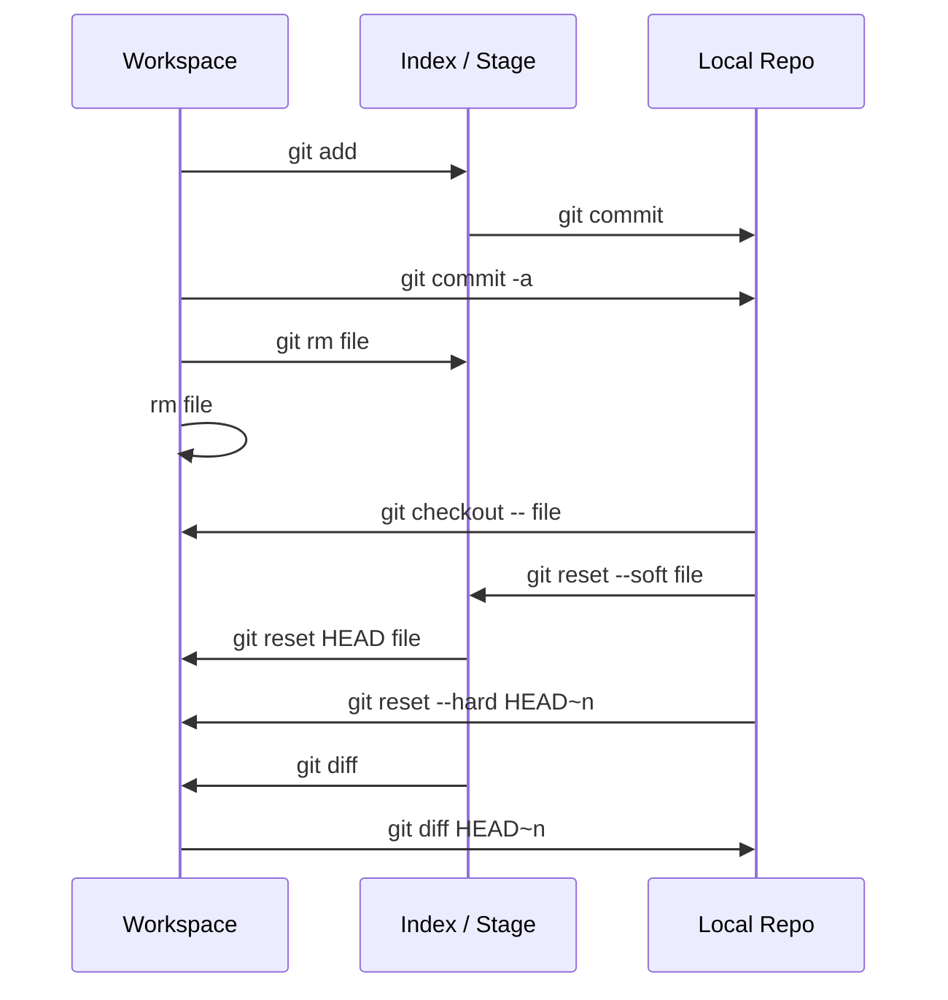

# Git 理论基础

版本控制就是对文件的版本控制，要对文件进行修改、提交等操作，首先要知道文件当前在什么状态，不然可能会提交了还不想提交的文件，或者要提交的文件没提交上。

Git 不关心文件两个版本之间的具体差别，而是关心文件的整体是否有改变。若文件被改变，在添加提交时就生成文件新版本的快照，而判断文件整体是否改变的方法就是用 SHA-1 算法计算文件的校验和。

## 文件的三种状态

Git 有三种状态：

| 状态     | 说明                                                         |
| :------- | :----------------------------------------------------------- |
| 已修改（modified）  | 已修改表示修改了文件，但还没保存到数据库中。       |
| 已暂存（staged）    | 已暂存表示对一个已修改文件的当前版本做了标记，使之包含在下次提交的快照中。 |
| 已提交（committed） | 已提交表示数据已经安全的保存在本地数据库中。       |

## 三个工作区域

由此引入 Git 工作区域的三个概念：

| 区域     | 说明                                                         |
| :------- | :----------------------------------------------------------- |
| 工作目录（Workspace）     | 项目存放代码的地方                               |
| 暂存区域（Index / Stage） | 用于临时存放你的改动，事实上它只是一个文件，保存即将提交到文件列表信息 |
| Git 本地仓库（Local Repo） | 存放项目文件的位置，其 HEAD 指向最新放入仓库的版本 |

## 文件状态转换

文件在这些区域之间的转换关系如下：

