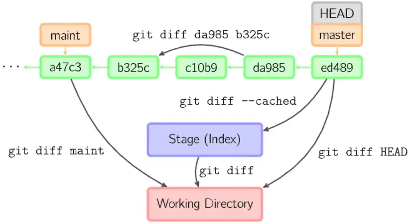

# diff

`git diff`用于显示工作树与索引或树之间的更改、索引与树之间的更改、两棵树之间的更改、合并产生的更改、两个 blob 对象之间的更改或磁盘上两个文件之间的更改。

可以把工作区中文件的状态和repo中文件的状态进行diff，命令如下：

```
git diff HEAD~n
```

`git diff`命令的示意图如下：



通常用法：

```bash
# 比较当前文件和暂存区中文件的差异，显示没有暂存起来的更改
$ git diff

# 显示摘要而非整个 diff
$ git diff --stat

# 比较暂存区中的文件和上次提交时的差异
$ git diff --cached
$ git diff --staged

# 查看已缓存的与未缓存的所有改动
# 比较当前文件和上次提交时的差异
$ git diff HEAD

# 查看从指定的版本之后改动的内容
$ git diff <commit ID>

# 比较两个分支之间的差异
$ git diff <分支名称> <分支名称>

# 查看两个分支分开后各自的改动内容
$ git diff <分支名称>...<分支名称>
```

