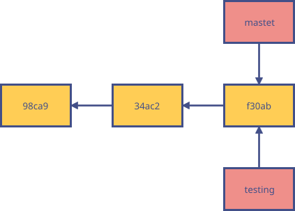
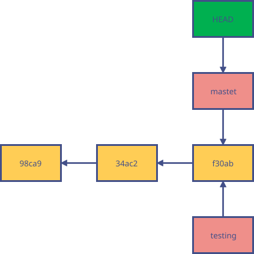

# git branch

分支管理可以让你从开发主线上分离开来，在不影响主线的同时继续工作。

Git 的分支，其本质上是指向提交对象的可变指针。当执行 `git init` 的时候，默认情况下 Git 就会为你创建 "master" 分支。

## 创建分支

```bash
# 创建新分支，新的分支基于上一次提交建立
$ git branch <分支名>
```

> 注意：`git branch` 命令只是创建一个新分支，并不会自动切换到新分支中去。

Git 是怎么创建新分支的呢？很简单，它只是为你创建了一个可以移动的新的指针。比如，创建一个 testing 分支，这会在当前所在的提交对象上创建一个指针。



那么，Git 又是怎么知道当前在哪一个分支上呢？也很简单，它有一个名为 `HEAD` 的特殊指针，指向当前所在的本地分支。



可以简单地使用 `git log --decorate` 命令查看各个分支当前所指的对象。

## 切换分支

当你切换分支的时候，Git 会用该分支的最后提交的快照替换你的工作目录的内容，多个分支不需要多个目录。

```bash
# 切换到已存在的分支
git checkout <branchname>

# 新建一个分支，并切换到该分支
git checkout -b <branch>

# 切换到上一个分支
git checkout -
```

## 列出分支

```bash
# 列出所有本地分支，当前所在分支以 * 标出
git branch

# 列出所有远程分支
git branch -r

# 列出所有本地分支和远程分支
git branch -a
```

## 重命名分支

```bash
# 如果不指定原分支名称则为当前所在分支
$ git branch -m [<原分支名称>] <新的分支名称>

# 强制修改分支名称
$ git branch -M [<原分支名称>] <新的分支名称>
```

## 删除分支

```bash
# 删除指定的本地分支
$ git branch -d <分支名称>

# 强制删除指定的本地分支
$ git branch -D <分支名称>

# 删除远程分支
git push origin --delete <branch-name>
git branch -dr <remote/branch>
```

## 合并分支

将分支的变动合并到当前分支中去：

```bash
git merge <分支名称>
```

选择一个 commit，合并进当前分支：

```bash
git cherry-pick <commit>
```
