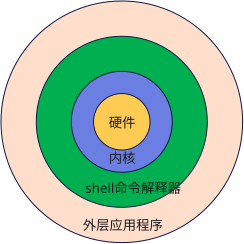

# 什么是shell

Bash 手册的介绍为：

> Unix shell 既是命令解释器，也是编程语言。

下面也将从这两个方面进行介绍：

## 作为命令解析器

Shell 是系统上的一个应用程序，用于解析用户命令并交给操作系统执行。

在早期操作系统中，用户只能通过敲击命令的方式进行系统操作，shell 在结构上成为用户与操作系统进行交互的接口。

Shell 程序有两种工作模式：

- 交互式（Interactive）：解释执行用户的命令，用户输入一条命令，Shell 就解释执行一条。
- 批处理（Batch）：用户事先写一个 Shell 脚本(Script)，让 Shell 一次把这些命令执行完，而不必一条一条地敲命令。

通常我们会直接在终端中输入命令来执行，但更多的时候一些工作并不是一个命令就能处理完成的，需要多条命令以及根据不同输出结果判断再执行。这时候批处理，编写 Shell 脚本就是一个非常不错的方法。

## 作为编程语言

Shell 解析器是支持运行脚本文件的，shell 一词也被用于指代它所支持的语言。

Shell 作为命令语言，它交互式解释和执行用户输入的命令或者自动地解释和执行预先设定好的一连串的命令；作为程序设计语言，它定义了各种变量和参数，并提供了许多在高级语言中才具有的控制结构，包括循环和分支。

Shell 脚本和编程语言非常相似，有变量和流程控制语句，但 Shell 脚本是解释执行的，不需要编译，Shell 程序从脚本中一行一行读取并执行这些命令，相当于一个用户把脚本中的命令一行一行敲到 Shell 提示符下执行。

Shell 只能说是脚本语言，严格上不能称为编程语言。与 JS、Python 等高级脚本语言相比，它具有以下特点：

- 简单，体积小。换个角度看，就是低级，不方便。
- Unix / Linux 内置，几乎没有环境依赖。
- 擅长系统操作密集任务，无法胜任计算密集的任务。

Shell 最大的优势体现在无环境依赖，如果无法保证执行环境或者不想增加环境依赖，就必须使用 shell 脚本，比如编写部署脚本时，难以保证服务器上安装了 Node 或 Python 环境，用 shell 更合适。
