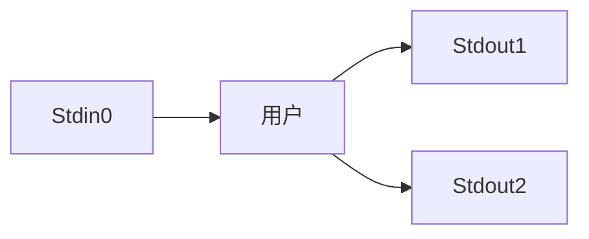

# 重定向和管道

重定向和管道是Linux系统进程间的一种通信方式，在系统管理中起着举足轻重的作用。

## 标准输入与输出

Linux系统中的绝大多数程序在运行时要进行输入和输出的操作。输入操作告诉程序所要处理的数据，输出操作则将程序的处理结果显示出来。由于Linux中一切皆文件，因此负责输入和输出的硬件设备也被视为系统中的一个文件。在用户通过操作系统处理信息的过程中，包括以下3类交互设备文件。

- 标准输入（Stdin）：默认的设备是键盘，文件描述符为0，程序从标准输入文件中读取在执行过程中需要的数据。
- 标准输出（Stdout）：默认的设备是显示器，文件描述符为1，程序将执行后的输出结果发送到标准输出文件。
- 标准错误（Stderr）：默认的设备是显示器，文件描述符为2，程序将执行时产生的错误信息发送到标准错误文件。

标准输入、标准输出和标准错误默认使用键盘和显示器作为关联的设备，因此，当执行命令时，会从键盘接收用户的输入数据，并将执行结果显示在屏幕上。如果命令执行错误，那么也会将错误信息显示在屏幕上反馈给用户。

一个Linux程序通常从标准输入中得到输入数据，并将正常数据输出到标准输出，将错误信息输出到标准错误。

下图是标准输入与输出的示意图：



在某些情况下，我们可能会希望从键盘以外的其他输入设备读取数据，或者将数据传送到显示器以外的其他输出设备，这种情况就称为重定向。Shell中的输入/输出重定向主要依靠重定向符号来实现，重定向的目标通常是一个文件。简单用一句话来概括：使用输入重定向能够把文件导入命令中，而输出重定向则能够把原本要输出到屏幕的信息写入指定文件中。

管道则为输入和输出重定向的结合，一个程序向管道的一端发送数据，而另一个程序从该管道的另一端读取数据，即“把前一个命令原本要输出到屏幕的数据当作是后一个命令的标准输入”。管道为不同命令之间的协同工作提供了一种机制，其符号是`|`。

## 标准输出重定向

输出重定向是将命令的输出结果重定向到一个文件中，而不是显示在屏幕上。在很多情况下可以使用这种功能。例如，编写一个对系统运行情况进行监控的脚本，脚本运行之后会输出一些信息，我们可以将这些输出信息重定向到一个文件中，以备随时查看。

输出重定向使用“>”和“>>”操作符，分别用于覆盖、追加文件内容。

如果“>”重定向符后指定的文件不存在，那么在命令执行过程中将新建该文件，并将命令结果保存到文件中。如果“>”重定向符后指定的文件存在，那么命令执行时将清空文件的内容并将命令结果保存到文件中。

例如，查看/etc/passwd文件的内容，并将输出结果保存到pass.txt文件中。

```shell
[root@localhost ~]# cat /etc/passwd > pass.txt
```

执行该命令后，会在当前目录下生成一个名为pass.txt的文件。文件中的内容就是“cat /etc/passwd”命令执行的结果。

如果“>”重定向的目标是一个已经存在的文件，那么就会将文件中的原有内容清空。因此，在使用“>”重定向时应慎重，确保不会丢失重要数据。“>>”重定向操作符可以将命令执行的结果重定向并追加保存到指定文件的末尾，而不覆盖文件中原有的内容。

例如，查看/etc/shadow文件的后3行内容，并将输出结果追加保存到pass.txt文件中。

```shell
[root@localhost ~]# tail -3 /etc/shadow >> pass.txt
```

灵活使用重定向可以实现很多其他功能。例如，执行下面的命令就可以将1.txt和2.txt这两个文本文件的内容合并到文件3.txt中。

```shell
[root@localhost ~]# cat 1.txt 2.txt > 3.txt
```

执行下面的命令可以将文件1.txt的内容复制到2.txt中，2.txt中原有的内容将被覆盖。

```shell
[root@localhost ~]# cat 1.txt > 2.txt
```

执行下面的命令可以将文件1.txt的内容追加到2.txt中。

```shell
[root@localhost ~]# cat 1.txt >> 2.txt
```

## 标准输入重定向

输入重定向就是将命令接收输入的途径由默认的键盘重定向为指定的文件，输入重定向需要使用“<”操作符。

例如，通过输入重定向查看/etc/passwd文件的内容。

```
[root@localhost ~]# cat < /etc/passwd
root:x:0:0:root:/root:/bin/bash
bin:x:1:1:bin:/bin:/sbin/nologin
daemon:x:2:2:daemon:/sbin:/sbin/nologin
……
```

可以发现，命令的执行结果与不使用重定向是完全一样的，这是因为对于cat命令，它的标准输入设备是键盘，我们之前所执行的命令“cat /etc/passwd”本身就是将输入重定向到了文件，相当于默认使用“<”操作符。

又如，我们直接执行cat命令，那么就会从标准输入设备（也就是键盘）上获取数据。此时，屏幕上会原样显示我们在键盘上输入的信息，直至按<Ctrl+D>组合键结束。

```
[root@localhost ~]# cat
how are you
how are you
happy every day
happy every day
Ctrl+d结束输入
```

除“<”之外，输入重定向的操作符还有“<<”，表示在此处创建文档。例如，我们执行下面的命令。

```
[root@localhost ~]# cat << EOF
> Hello World
> How are you
> Bye
> EOF
Hello World
How are you
Bye
```

在上面这条命令中，使用了重定向操作符“<<”，在它后面可以接一个结束标记（这里用的是EOF）。在执行“cat << EOF”命令之后，我们就可以像写一篇文档一样从键盘上输入数据。如果要结束输入，那么就输入结束标记EOF，这时系统就会把我们刚才所输入的信息原样显示在屏幕上。

利用该功能，我们可以将一段连续的信息输入指定的文档中。例如，将之前输入的信息存放到test.txt文件中。

```
[root@localhost ~]# cat > test.txt << EOF
> Hello World
> How are you
> Bye
> EOF
[root@localhost ~]# cat test.txt
Hello World
How are you
Bye
```

该功能还经常被用来制作Shell脚本的输出标题。

```
[root@localhost ~]# cat << EOF
>      *************************
>          欢迎使用测试脚本
>      *************************
> EOF
     *************************
         欢迎使用测试脚本
     *************************
```

注意，结束标记并非只能使用EOF（End Of File），而是可以根据需要自行定义。当要结束输入时，结束标记必须要在最后一行的行首顶格书写。

## 标准错误重定向

标准错误重定向就是将命令执行过程中出现的错误信息重新定向并保存到指定的文件中，而不是直接显示在屏幕上。由于标准错误所对应的设备也是显示器，因此为了与标准输出进行区分，标准错误重定向的表示符号是“2>”，2是标准错误输出的文件描述符。其实之前在使用标准输入重定向、标准输出重定向时也应分别使用0、1描述符，只是因为这是默认值，所以通常会省略。

例如，执行下面的find命令，命令执行后既有正确查找结果，又有错误提示信息。

```
[root@localhost ~]# find / -user student
find: '/proc/55112/task/55112/fd/6': 没有那个文件或目录
find: '/proc/55112/task/55112/fdinfo/6': 没有那个文件或目录
find: '/proc/55112/fd/6': 没有那个文件或目录
find: '/proc/55112/fdinfo/6': 没有那个文件或目录
/var/spool/mail/student
/home/student
/home/student/.mozilla
……
```

我们将上面这条命令的执行结果重定向保存到一个指定的文件find1.txt中，但是屏幕上依然出现了错误信息。这是由于在默认情况下只能重定向标准输出而无法重定向标准错误。查看find1.txt文件，其中保存的也仅有正确查找结果。

```
[root@localhost ~]# find / -user student > find1.txt
find: '/proc/55121/task/55121/fd/6': 没有那个文件或目录
find: '/proc/55121/task/55121/fdinfo/6': 没有那个文件或目录
find: '/proc/55121/fd/6': 没有那个文件或目录
find: '/proc/55121/fdinfo/6': 没有那个文件或目录
```

但是，在某些情况下，我们所关注的可能恰恰就是错误输出信息，比如需要将某个程序运行过程中产生的错误信息都保存到指定的文件中，这时就需要专门针对错误信息进行重定向了。我们再次执行这条命令，并将错误信息重定向保存到find2.txt文件中，这时在屏幕上就只显示正确查找结果，而在find2.txt文件中则专门存放错误信息。

```
[root@localhost ~]# find / -user student 2> find2.txt
/var/spool/mail/student
/home/student
/home/student/.mozilla
……
```

有时我们还可能需要将程序运行的所有信息，无论其是正确还是错误，都保存到指定文件中，这时就可以使用符号“&>”或“&>>”来合并正常输出和错误输出。

```
[root@localhost ~]# find / -user student &> find3.txt
```

在Linux中，还提供了一个特殊的设备文件/dev/null，这是一个被称为“黑洞”的空设备文件，任何进入该设备的数据都将被“吞并”。如果我们将重定向的目标指向它，那么系统将不会有任何的反应或显示，相当于将这部分信息被丢弃了。有的命令在执行过程中会产生一些错误信息，而我们并不关心这些错误信息，只想看到正常执行的结果，这时就可以通过将标准错误重定向到/dev/null文件，来过滤这些错误信息。

例如，只显示find命令查找的正确结果，过滤错误信息。

```
[root@localhost ~]# find / -user student 2> /dev/null
/var/spool/mail/student
/home/student
/home/student/.mozilla
……
```

对于黑洞文件/dev/null，也可以灵活使用，比如清空一个文件的内容。

```
[root@localhost ~]# cat /dev/null > test.txt
```

## 管道符`|`

通过管道符`|`，可以把多个简单的命令连接起来以实现更加复杂的功能。

管道符`|`用于连接左右两个命令，将`|`左边命令的执行结果作为`|`右边命令的输入，这样`|`就像一根管道一样连接着左右两条命令，并在管道中实现数据从左至右的传输。

例如，ls命令与more命令通过管道符组合使用，便可以实现目录列表分页显示的功能。

例如，分页显示/etc目录下所有文件和子目录的详细信息。

```
[root@localhost ~]# ls -lh /etc | more
```

ls命令与grep命令通过管道符组合可以只显示目录列表中包含特定关键字的列表项。
