# vi 文本编辑器

vi 是 Visual Interface 的简写，它是一个功能强大的文本编辑工具，是 Linux 系统中默认的文本编辑器。vim 是 Visual Interface Improved 的简写，相当于 vi 的增强版。一般系统管理维护时使用 vi 即可，而 vim 是具有编程能力的，可以主动识别文件中的字体颜色以判断正确性，如果需要文件中的内容高亮显示的话，可以使用 vim。

## vi 编辑器的 3 种模式

vi 编辑器一共有 3 种模式：

- 命令模式：默认模式，一般用于浏览和修改文件内容。该模式主要实现光标移动，删除、复制和粘贴文件内容等相关操作。
- 输入模式：也称为插入模式，用于对文件内容的修改。
- 末行模式：用于保存文件和退出 vi 编辑器。

3 种状态之间是如何切换的呢？在命令模式下，可以按键盘上的 a、i、o 键进入输入模式，按冒号`:`键进入末行模式；在输入模式和末行模式下，可以按 Esc 键退回到命令模式。注意，无法直接从输入模式进入末行模式。vi 编辑器三种模式的切换如图所示：

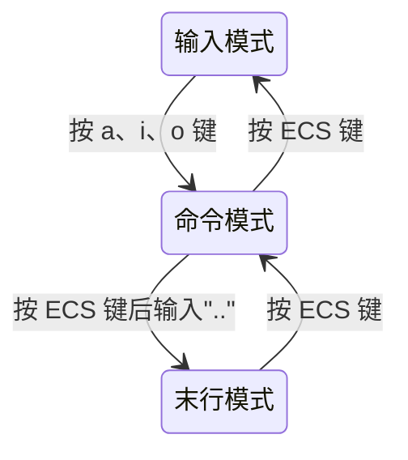

> 需要输入的字母按键是区分大小写的。

## 命令模式的操作键

直接执行 vi 命令就可以进入 vi 编辑器的命令模式，可以查看相关 vi 版本和帮助信息。vi 命令后面跟文件名，可以直接对文件进行操作，如果该文件不存在，则会创建一个空白的文件。下面将以表格的形式呈现 vi 编辑器命令模式的相关操作键。

### 光标移动操作

在命令模式中实现光标移动、行内移动、行间移动及显示行号等相关操作的快捷键及其功能说明如表所示：

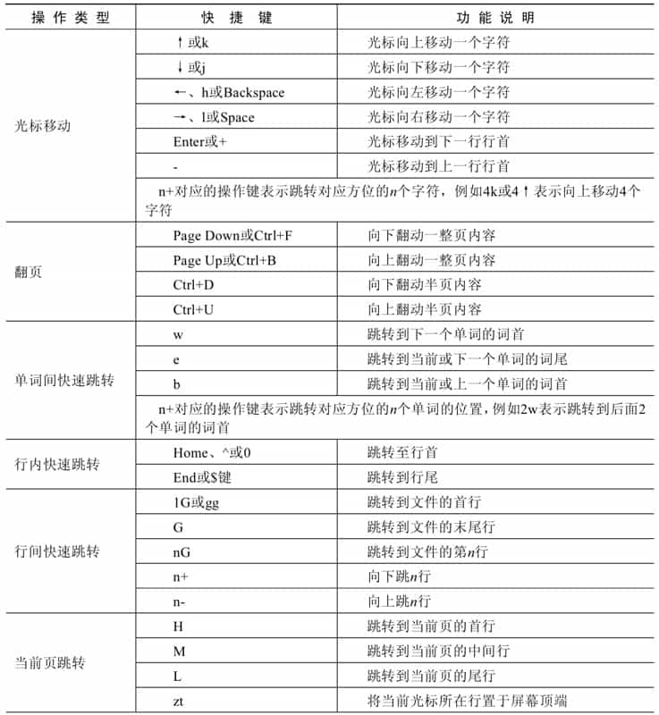

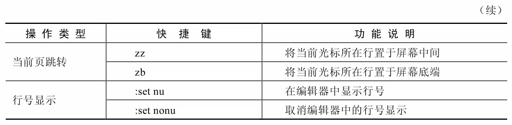

### 复制、粘贴和删除操作

在命令模式中对文件内容的快速复制、粘贴及删除操作的快捷键及其功能说明如表所示：

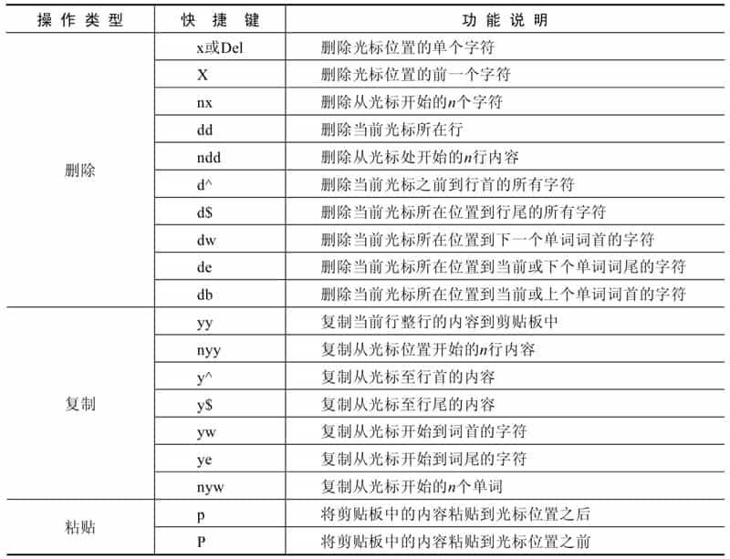

### 搜索操作

在命名模式中当文件内容太多，需要快速查找到特定内容时，可以通过快捷键的方式进行搜索，相关的快捷键及其功能说明如表所示：

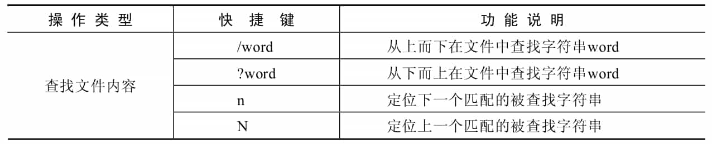

### 撤销操作

在命令模式中如果不小心误操作，需要回退上一步操作恢复数据内容，则可以按撤销快捷键进行恢复，也可以直接进入末行模式再退出且不保存，这样之前所有的操作将全部失效。撤销操作的快捷键及其功能说明如表所示：

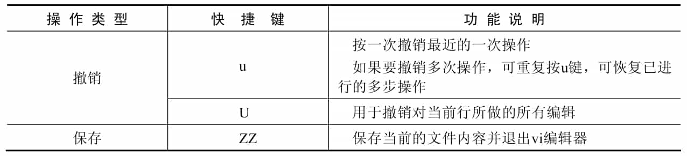

## 输入模式的操作键

输入模式就是对文件内容进行添加和修改等操作。从命令模式进入输入模式可以使用 a、i、o 进行切换，切换到输入模式后，在 vi 编辑器的最底端会有“--INSERT--”标记。

### 模式切换

从命令模式切换到输入模式的快捷键及其功能说明如表所示：

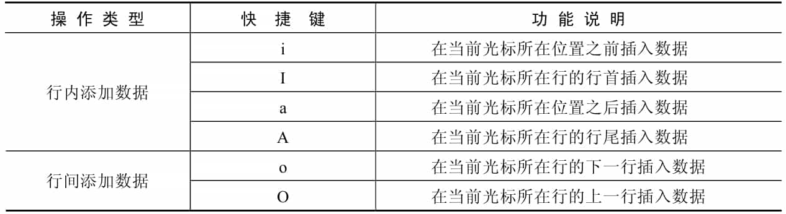

### 输入模式操作

输入模式下光标移动和删除等相关操作的快捷键及其功能说明如表所示：

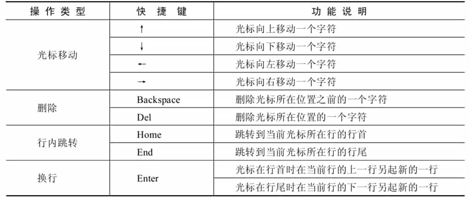

## 末行模式的操作键

在末行模式下可以对文件进行修改、保存、退出和替换文件内容等操作，在命令模式中可以使用“:”切换到末行模式，当 vi 编辑器左下角的位置显示“:”符号，就表示此时位于末行模式。

### 保存和退出操作

文件保存和退出操作的命令如表所示：

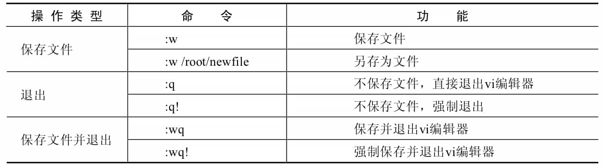

### 打开新文件的操作

在使用 vi 编辑器时可以在不关闭现有编辑器的前提下直接读取或打开其他位置的文件，相关的操作命令如表所示：

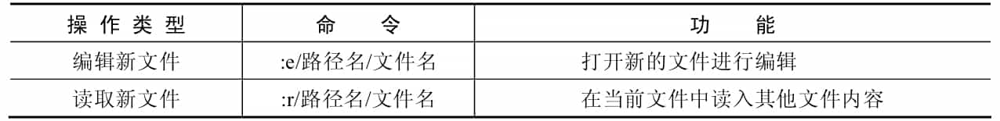

### 替换操作

对文件中的数据进行批量替换的操作命令如表所示：

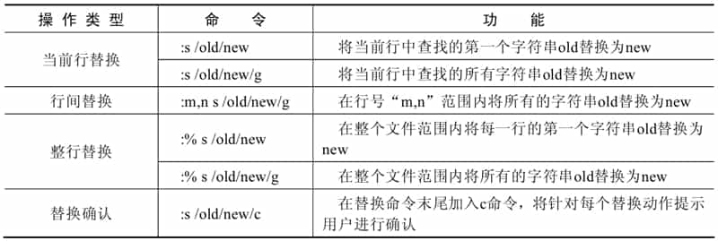
