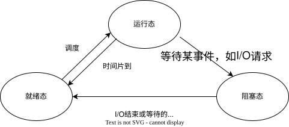

# 进程的相关介绍

## 什么是进程

在操作系统中进行的所有操作都是通过运行相应的程序来实现的，我们可以在系统中安装很多应用程序。这些程序平时都存储在硬盘中。当要运行某个程序时，就要将其从硬盘调入内存中，以供CPU进行运算和处理。这些系统中正在运行的程序被称为进程，是系统正在执行的任务。

虽然进程也是程序，但它和程序是有区别的。程序只占用磁盘空间，不占用系统运行资源。进程由程序产生，要占用CPU和内存等系统资源，当关闭进程之后，它所占用的资源也随之释放。例如，用户打开一个文件，就会产生一个打开文件的进程，关闭文件，进程也随之关闭。另外，并非每个程序只能对应一个进程，有的程序启动后可以创建一个或多个进程，例如提供Web服务的httpd程序，在它运行之后，会自动产生6个进程，以应对大量用户的同时访问请求。

进程也是分配和调度操作系统资源的基本单位。Linux是一个多用户多任务的操作系统。多用户是指多个用户可以在同一时间使用同一个Linux系统；多任务是指在Linux中可以同时运行多个程序，执行多个任务。这里主要介绍一下多任务，在我们同时运行了多个程序之后，系统中会产生很多个进程，所有的进程都需要由CPU来进行运算和处理，而CPU在同一个时刻其实只能处理一个进程的数据，那么如何让CPU同时处理多个进程的数据呢？由于CPU的运算速度非常快，因此采取的方法就是将CPU的工作时间划分成很多个时间片，每个时间片很短，然后将所有的进程都放在一个队列中，操作系统根据每个进程的优先级为它们轮流分配时间片，分配到时间片的进程就可以去执行。如果时间片用完，而相应的进程仍然没有运行结束，那么系统就会将其暂时挂起并放到队列的后部，等到它再次轮到时间片的时候才会去执行。如果进程运行结束，就将其从队列中去除。操作系统中的多个进程其实是在轮流执行的，但由于速度太快，用户根本感觉不到。

当然，上面提到的是单CPU多任务操作系统的情形，在这种环境下，虽然系统可以运行多个任务，但是在某一个时间点，CPU只能执行一个任务，而在多CPU多任务的操作系统下，由于有多个CPU，因此在某个时间点上，可以有多个任务同时执行。

## 进程的状态

进程在启动后不一定马上开始运行，因而进程存在很多种状态。从理论的角度来说，在进程的运行过程中通常会在3种基本状态之间转换：运行态、就绪态、阻塞态（等待态），如图所示：



1.  运行态：运行态是指当前进程已分配到CPU，正在处理器上执行时的状态。处于运行态的进程个数不能大于CPU的数目，在单CPU环境中，任何时刻处于运行态的进程最多有一个。

2.  就绪态：就绪态是指进程已具备运行条件，但因为其他进程正占用CPU，所以暂时不能运行而等待分配CPU的状态。一旦把CPU分给它，就可以立即运行。

3.  阻塞态：阻塞态（等待态）是指进程因等待某种事件发生（如等待某一输入/输出操作完成、等待其他进程发来的信号等）而暂时不能运行的状态。此时即使CPU空闲，阻塞态的进程也不能运行，系统中处于这种状态的进程也可以是多个。当阻塞态进程所要等待的事件发生之后，就会转入就绪态。

具体到Linux系统中，进程所处的状态要更为复杂多样一些。系统为每种进程状态都定义了一个符号，以便更好地区分标记。

-   可运行状态（R）：处于这种状态的进程，要么正在运行，要么正准备运行。也就是说，理论上处于运行态和就绪态的进程，在Linux系统中都被视作可运行状态。
-   可中断的睡眠状态（S）：这类进程处于阻塞状态，一旦达到某种条件，就会变为就绪态。
-   不可中断的睡眠状态（D）：与“可中断的睡眠状态”含义基本类似，唯一不同的是处于这个状态的进程对中断信号不做响应。例如，某个进程正在从硬盘向内存中读入大量数据时，就会处于这种状态。
-   僵死状态（Z）：正常情况下，子进程应该由父进程结束，并释放其所占用的系统资源。当某个进程已经运行结束，但是它的父进程还没有释放其系统资源时，这个进程就会处于僵死状态。
-   停止状态（T）：此时的进程暂停于内存中，但不会被调度，等待接受某种特殊处理。

## 父进程和子进程

除初始化进程systemd之外，Linux中的每个新进程都必须由已经在运行的进程来创建，这样就构成了父进程和子进程。

systemd是Linux启动的第一个进程，系统中的其他所有进程都是systemd进程的子进程。除systemd之外，每个进程都必须有一个父进程。父进程和子进程之间的关系是管理和被管理的关系。当父进程终止时，子进程也随之而终止，但子进程终止，父进程并不一定终止。

如果父进程在子进程结束之前就退出了，那么它的子进程就变成了“孤儿”进程。如果没有相应的处理机制的话，这些“孤儿”进程就会一直处于僵死状态，资源无法释放。此时解决的办法是在已经启动的进程里寻找一个进程来作为这些“孤儿”进程的父进程，或者直接让systemd进程作为它们的父进程，进而释放“孤儿”进程占用的资源。

## 进程的属性

在进程启动后，操作系统就为每个进程分配唯一的进程标识符，称为进程ID（PID）。

PID是区别每个进程的唯一标识，systemd进程的PID固定为1，除此之外，其他所有进程的PID都是不固定的。当进程启动时，系统为其自动分配一个PID，进程结束时，系统就将这个PID收回。

除PID之外，每个进程通常还具有以下属性。

- 父进程的ID（PPID）。
- 启动进程的用户名（UID）。
- 进程的状态。
- 进程执行的优先级。
- 进程所在的终端名。
- 进程资源占用：进程占用资源的大小，如占用内存、CPU的情况等。

通过pidof命令就可以查询某个指定进程的PID，比如查看sshd服务的进程PID。

```
[root@localhost ~]# pidof sshd
1990 1963 1931 1902 1008
```

可以看到这里列出了5个进程PID，这是由于在运行了sshd服务之后，系统会为root用户会启动一个sshd主进程，其他用户产生一个sshd子进程，然后每当有用户远程连接上Linux，也会产生一个sshd子进程，因而当前系统中有一个用户正在远程登录。

## 进程的分类

按照进程的功能和运行的程序不同，进程可划分为两个大类。

- 系统进程：可以执行内存资源分配和进程切换等管理工作，这些进程的运行不受用户的干预，即使是root用户也不能干预系统进程的运行。
- 用户进程：通过执行用户程序、应用程序或内核之外的系统程序而产生的进程。此类进程可以在用户的控制下运行或关闭。我们所要了解和管理的主要就是这类用户进程。

针对用户进程，主要又分为：

- 交互进程：由Shell启动的进程，即在终端通过输入命令启动的进程。交互进程既可以在前台运行，又可以在后台运行。
- 守护进程：主要是由运行各种服务所产生的进程，一般在系统后台运行，而且通常会随着Linux系统的启动而启动，在系统关闭的同时终止。由于守护进程始终是运行着的，因此一般其所处的状态是等待处理请求任务。例如，无论是否有人访问Web服务器上的网站，该服务器上的httpd服务都一直在运行。
