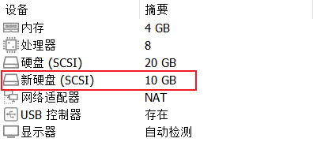

# 磁盘分区与格式化

在本章中，将通过为 Linux 虚拟机新增一块硬盘并建立分区的过程，介绍 fdisk 分区工具的使用，以及如何用 mkfs 命令对分区进行格式化。当然，在此之前还必须先了解在 Linux 系统中如何表示硬盘和硬盘分区。

## Linux 磁盘及分区的表示方法

操作系统的所有数据都存储在磁盘分区中，在传统的磁盘管理中，磁盘分区包括主分区、扩展分区和逻辑分区 3 种类型。之所以会有这样的区分，是因为在硬盘的主引导扇区（MBR）中用来存放分区信息的空间只有 64 字节（主引导扇区一共只有 512 字节空间），而每一个分区的信息都要占用 16 字节空间，因而理论上一块磁盘最多只能拥有 4 个分区。当然，这 4 个分区都是主分区。这在计算机发展早期没什么问题，但后来随着硬盘空间越来越大，4 个分区就远远不够了，因此，才引入了扩展分区的概念。扩展分区也是主分区，但它不能直接使用，它就相当于是一个容器，可以在扩展分区中再创建新的分区，这些分区被称为逻辑分区。逻辑分区的数量不再受主引导扇区空间大小的限制，像 SCSI 或 SATA 接口的磁盘在 Linux 系统中最多可以创建 12 个逻辑分区。

在 Linux 系统中，所有的磁盘和磁盘中的每个分区都是用文件的形式来表示的。例如，在计算机中有一块硬盘，硬盘上划分了 3 个分区，那么在 Linux 系统中就会有相对应的 4 个设备文件，一个是硬盘的设备文件，另外每个分区也有一个设备文件，所有的设备文件都统一存放在/dev 目录中。

不仅仅是硬盘，绝大多数的硬件设备在 Linux 系统中是以文件的形式存在的。`一切皆文件`正是 Linux 系统的重要特点之一。

不同类型硬盘和分区的设备文件都有统一的命名规则，具体表述形式如下：

- 硬盘：对于 SATA 或 SCSI 接口的硬盘设备，采用`sdX`形式的文件名，其中`X`为 a、b、c、d 等字母序号。例如，系统中的第一块硬盘表示为`sda`，第二块硬盘表示为`sdb`。
- 分区：表示分区时，以硬盘设备的文件名作为基础，在后边添加该分区对应的数字序号。例如，第一块硬盘中的第一个分区表示为`sda1`、第二个分区表示为`sda2`，第二块硬盘中的第一个分区表示为`sdb1`，依此类推。

需要注意的是，由于主分区的数目最多只有 4 个，因此主分区和扩展分区的序号也就限制为 1～4，而逻辑分区的序号将始终从 5 开始。例如，即便系统中的第一块硬盘只划分了 1 个主分区和 1 个扩展分区，第一个逻辑分区的序号仍然是从 5 开始，应表示为`sda5`。

Linux 中所有的设备文件都存放在/dev 目录中，一个磁盘分区设备文件的各部分含义可参考如下：

```text
/dev/sda5
-- dev : 硬件设备文件所在的目录
-- sd  : hd 表示 IDE 设备，sd 表示串行设备
-- a   : 硬盘的顺序号，以字母 a、b、c………表示
-- 5   : 分区的顺序号，以数字 1、2、3………表示
```

另外，对于所有使用 USB 接口的移动存储设备，一律使用/dev/sdX 的设备文件。光驱（光盘）的设备文件则一般默为`/dev/cdrom`。

## Linux 的文件系统

文件系统是操作系统的重要组成部分，它决定了在磁盘分区中存放、读取文件数据的方式和效率。对于一块新的磁盘，在向其中存放数据之前，必须先创建文件系统。文件系统是在对磁盘分区进行高级格式化时被创建的，在系统中会存在很多不同类型的文件系统，可以根据情况选择合适的文件系统类型。

在 Windows 系统中，硬盘分区通常采用 FAT32 或 NTFS 文件系统，而在 Linux 系统中，硬盘分区则大多采用 EXT 系列和 XFS 文件系统。在 CentOS 7 之前，采用 EXT 系列文件系统，从 CentOS 7 开始，则转向了 XFS 文件系统，这种文件系统被认为更适合大数据环境。

Linux 也可以支持 Windows 中的 FAT32 文件系统，只不过在 Linux 系统中名称换成了 VFAT。Linux 不支持 NTFS 文件系统，如果要在 Linux 系统中使用采用 NTFS 文件系统的硬盘分区，那么需要额外安装 NTFS-3G 软件包。

在文件`/etc/filesystems`中存放了 Linux 支持的所有文件系统类型，其中`iso9660`是指光盘所采用的文件系统类型。

```shell
[root@localhost ~]# cat /etc/filesystems
ext4
ext3
ext2
nodev proc
nodev devpts
iso9660
vfat
hfs
hfsplus
*
```

另外，Linux 中还有一个比较特殊的 swap 类型的文件系统。swap 文件系统是专门给交换分区使用的。交换分区类似于 Windows 系统中的虚拟内存，能够在一定程度上解决物理内存不足的问题。不同的是，在 Windows 系统中是采用一个名为 pagefile.sys 的系统文件作为虚拟内存使用，而在 Linux 系统中则是划分了一个单独的分区作为虚拟内存，这个分区被称为交换分区。交换分区的大小通常设置为主机物理内存的 2 倍，如主机的物理内存大小为 1GB，则交换分区大小设置为 2GB 即可。由于现在的服务器普遍配置了大容量内存，因此对于内存容量在 8GB 以上的服务器，交换分区大小统一设置为 8GB 即可。在安装 Linux 系统时，如果选择由系统自动对硬盘进行分区，那么系统会自动创建 swap 交换分区，并为其分配适当的磁盘空间，一般也无须再额外进行配置。

## 查看分区信息

在 Linux 中，基本的磁盘及分区管理工具是 fdisk。fdisk 命令的基本格式如下。

```text
fdisk [-l] [设备名称]
```

fdisk 命令不仅可以进行硬盘分区，还可以查看硬盘以及分区信息，这要用到`-l`选项。`fdisk -l`命令的作用是列出当前系统中所有磁盘设备及其分区的信息，命令执行结果如下所示：

```sh
[root@localhost ~]# fdisk -l
Disk /dev/sda: 20 GiB，21474836480 字节，41943040 个扇区
磁盘型号: VMware Virtual S
单元: 扇区 / 1 * 512 = 512 字节
扇区大小(逻辑/物理): 512 字节 / 512 字节
I/O 大小(最小/最佳): 512 字节 / 512 字节
磁盘标签类型: dos
磁盘标识符: 0x357f6998

设备       启动    起点     末尾     扇区 大小 Id 类型
/dev/sda1  *       2048  2099199  2097152   1G 83 Linux
/dev/sda2       2099200 41943039 39843840  19G 8e Linux LVM

Disk /dev/mapper/cs-root: 17 GiB，18249416704 字节，35643392 个扇区
单元: 扇区 / 1 * 512 = 512 字节
扇区大小(逻辑/物理): 512 字节 / 512 字节
I/O 大小(最小/最佳): 512 字节 / 512 字节

Disk /dev/mapper/cs-swap: 2 GiB，2147483648 字节，4194304 个扇区
单元: 扇区 / 1 * 512 = 512 字节
扇区大小(逻辑/物理): 512 字节 / 512 字节
I/O 大小(最小/最佳): 512 字节 / 512 字节
```

包含了硬盘的整体情况和分区信息，其中分区信息的各字段含义如下：

- 设备：分区的设备文件名称。
- 启动(Boot)：表示是否是引导分区，若是，则带有`*`标识。
- 起点(Start)：该分区在硬盘中的起始位置。
- 末尾(End)：该分区在硬盘中的结束位置。
- 扇区大小(Blocks)：表示分区的大小，以 Block（块）为单位，默认的块大小为 4KB。
- Id：表示分区类型的 ID 标记号，对于 XFS 分区，其为 83；对于 LVM 分区，其为 8e。
- 类型(Type)：表示分区类型，`Linux`代表 XFS 文件系统，`Linux LVM`代表逻辑卷。

## 在虚拟机中添加硬盘

为了练习硬盘分区操作，需要事先在虚拟机中添加额外的硬盘。由于 SCSI 接口的硬盘支持热插拔，因此可以在虚拟机开机状态下直接添加硬盘。

打开虚拟机的硬件设置界面，单击`添加`按钮，添加一块容量为 10GB 的 SCSI 硬盘，如图所示：



然后，需要将虚拟机重启以识别新增加的硬盘。

系统重新启动之后，执行`fdisk -l`命令查看硬盘分区信息，可以发现增加的硬盘`/dev/sda`，新的硬盘设备还未进行初始化，因而没有包含有效的分区信息，如下所示：

```text
Disk /dev/sda：10 GiB，10737418240 字节，20971520 个扇区
磁盘型号：VMware Virtual S
单元：扇区 / 1 * 512 = 512 字节
扇区大小(逻辑/物理)：512 字节 / 512 字节
I/O 大小(最小/最佳)：512 字节 / 512 字节
```

## 利用 fdisk 对硬盘进行分区

以硬盘设备文件名为参数执行 fdisk 命令，就可以通过交互方式对相应的硬盘进行创建、删除、更改分区等操作。

下面执行`fdisk /dev/sda`命令，进入交互式的分区管理界面，如下所示：

```shell
[root@localhost ~]# fdisk /dev/sda
欢迎使用 fdisk (util-linux 2.37.2)。
更改将停留在内存中，直到您决定将更改写入磁盘。
使用写入命令前请三思。

设备不包含可识别的分区表。
创建了一个磁盘标识符为 0x61ea98ea 的新 DOS 磁盘标签。

命令(输入 m 获取帮助)：
```

在操作界面中的`命令(输入 m 获取帮助):`提示符后，用户可以输入特定的分区操作指令，完成各项分区管理任务。在输入`m`指令后，可以查看各种操作指令的帮助信息，如下所示：

```text
命令(输入 m 获取帮助)：m

帮助：

  DOS (MBR)
   a   开关 可启动 标志
   b   编辑嵌套的 BSD 磁盘标签
   c   开关 dos 兼容性标志

  常规
   d   删除分区
   F   列出未分区的空闲区
   l   列出已知分区类型
   n   添加新分区
   p   打印分区表
   t   更改分区类型
   v   检查分区表
   i   打印某个分区的相关信息

  杂项
   m   打印此菜单
   u   更改 显示/记录 单位
   x   更多功能(仅限专业人员)

  脚本
   I   从 sfdisk 脚本文件加载磁盘布局
   O   将磁盘布局转储为 sfdisk 脚本文件

  保存并退出
   w   将分区表写入磁盘并退出
   q   退出而不保存更改

  新建空磁盘标签
   g   新建一份 GPT 分区表
   G   新建一份空 GPT (IRIX) 分区表
   o   新建一份的空 DOS 分区表
   s   新建一份空 Sun 分区表

命令(输入 m 获取帮助)：
```

使用 n 命令创建分区，然后系统提示选择分区类型，`p`代表主分区，`e`代表扩展分区，我们这里选择创建主分区。之后需要依次选择分区序号、起始位置和结束位置（或分区大小），即可完成新分区的创建。创建容量为 5GB、分区编号为 1 的主分区过程如下：

```text
命令(输入 m 获取帮助)：n  #创建分区
分区类型
   p   主分区 (0 primary，0 extended，4 free)
   e   扩展分区 (逻辑分区容器)
选择 (默认 p)：p    #选择分区类型
分区号 (1-4，默认  1): 1    #选择分区编号
第一个扇区 (2048-20971519，默认 2048):     #选择起始扇区，建议直接按回车键
最后一个扇区，+/-sectors 或 +size{K,M,G,T,P} (2048-20971519，默认 20971519): +5G     #指定分区容量

创建了一个新分区 1，类型为`Linux`，大小为 5 GiB。
```

选择分区号时，主分区和扩展分区的序号范围只能为 1～4。分区起始位置一般由 fdisk 默认识别，结束位置或分区大小可以使用``+size{K，M，G}``（大括号中为可选的单位）的形式，如`+5G`表示将分区的容量设置为 5GB。

分区结束之后，可以输入 p 命令查看创建好的分区/dev/sdb1，如下所示：

```text
命令(输入 m 获取帮助)：p
Disk /dev/sda：10 GiB，10737418240 字节，20971520 个扇区
磁盘型号：VMware Virtual S
单元：扇区 / 1 * 512 = 512 字节
扇区大小(逻辑/物理)：512 字节 / 512 字节
I/O 大小(最小/最佳)：512 字节 / 512 字节
磁盘标签类型：dos
磁盘标识符：0x61ea98ea

设备       启动  起点     末尾     扇区 大小 Id 类型
/dev/sda1        2048 10487807 10485760   5G 83 Linux
```

下面再继续创建两个逻辑分区。在创建逻辑分区之前，首先需要创建扩展分区，如下所示：需要注意的是，必须把所有剩余空间全部分给扩展分区。

```shell
命令(输入 m 获取帮助)：n     #继续创建分区
分区类型
   p   主分区 (1 primary, 0 extended, 3 free)
   e   扩展分区 (逻辑分区容器)
选择 (默认 p)：e    #设置分区类型为扩展分区
分区号 (2-4，默认  2): 4     #指定分区编号为 4
第一个扇区 (10487808-20971519，默认 10487808):   #起始和结束扇区均直接按回车键，采用默认值
最后一个扇区，+/-sectors 或 +size{K,M,G,T,P} (10487808-20971519，默认 20971519): #起始和结束扇区均直接按回车键，采用默认值
创建了一个新分区 4，类型为`Extended`，大小为 5 GiB。
```

在创建好扩展分区之后，就可以创建逻辑分区了。在创建逻辑分区的时候不需要指定分区编号，系统会自动从 5 开始顺序编号，如下所示：

创建两个逻辑分区：

```shell
#  创建第一个逻辑分区

命令(输入 m 获取帮助)：n
所有主分区的空间都在使用中。
添加逻辑分区 5
第一个扇区 (10489856-20971519，默认 10489856):
最后一个扇区，+/-sectors 或 +size{K,M,G,T,P} (10489856-20971519, 默认 20971519): +3G #分区容量指定为 3GB

创建了一个新分区 5，类型为`Linux`，大小为 3 GiB。

#  创建第二个逻辑分区

命令(输入 m 获取帮助)：n
所有主分区的空间都在使用中。
添加逻辑分区 6
第一个扇区 (16783360-20971519, 默认 16783360):
最后一个扇区，+/-sectors 或 +size{K,M,G,T,P} (16783360-20971519, 默认 20971519): # 剩余空间全部给第二个逻辑分区

创建了一个新分区 6，类型为`Linux`，大小为 2 GiB。
```

最后，再次输入 p 命令，查看分区情况：

```text
命令(输入 m 获取帮助)：p
Disk /dev/sda：10 GiB，10737418240 字节，20971520 个扇区
磁盘型号：VMware Virtual S
单元：扇区 / 1 * 512 = 512 字节
扇区大小(逻辑/物理)：512 字节 / 512 字节
I/O 大小(最小/最佳)：512 字节 / 512 字节
磁盘标签类型：dos
磁盘标识符：0x61ea98ea

设备       启动     起点     末尾     扇区 大小 Id 类型
/dev/sda1           2048 10487807 10485760   5G 83 Linux
/dev/sda4       10487808 20971519 10483712   5G  5 扩展
/dev/sda5       10489856 16781311  6291456   3G 83 Linux
/dev/sda6       16783360 20971519  4188160   2G 83 Linux
```

在完成对硬盘的分区操作后，可以执行`w`命令保存并退出或执行 q 命令以不保存方式退出 fdisk，如下所示：

```text
命令(输入 m 获取帮助)：w     #保存退出
分区表已调整。
将调用 ioctl() 来重新读分区表。
正在同步磁盘。
```

硬盘分区设置完成以后，可以执行`cat /porc/partitions`命令查看系统内核是否已经识别出了新的硬盘分区，否则可以执行`partprobe /dev/sdb`命令强制使系统加载新的分区表，或者通过重启系统方式使分区生效。

例如，查看系统内核是否已经识别出新分区。

```text
[root@localhost ~]# cat /proc/partitions
major minor  #blocks  name

   8        0   10485760 sda
   8        1    5242880 sda1
   8        4          1 sda4
   8        5    3145728 sda5
   8        6    2094080 sda6
   8       16   20971520 sdb
   8       17    1048576 sdb1
   8       18   19921920 sdb2
 253        0   17821696 dm-0
 253        1    2097152 dm-1
```

如果需要删除已创建好的分区，那么可以在 fdisk 命令操作界面中使用 d 命令将指定的分区删除，然后根据提示输入需要删除的分区序号即可。在删除时，建议从最后一个分区开始，以避免 fdisk 识别的分区序号发生紊乱。另外，如果扩展分区被删除，则扩展分区之下的逻辑分区也将同时被删除。

## 格式化分区

分区创建好之后，还必须经过格式化才能使用。格式化的主要目的是在分区中创建文件系统。CentOS 7 默认使用的文件系统是 XFS，也支持之前版本所采用的 EXT 文件系统。

格式化分区的命令是 mkfs，使用`-t`选项指定所要采用的文件系统类型。

mkfs 命令的基本格式如下。

```text
mkfs –t 文件系统类型 分区设备文件名
```

例如，将/dev/sdb1 格式化为 XFS 文件系统。

```text
[root@localhost ~]# mkfs -t xfs /dev/sdb1
```

例如，将/dev/sdb5 格式化为 EXT4 文件系统。

```shell
[root@localhost ~]# mkfs -t ext4 /dev/sdb5
```

需要注意的是，因为格式化时会清除分区上的所有数据，所以应注意安全，事先进行备份。
