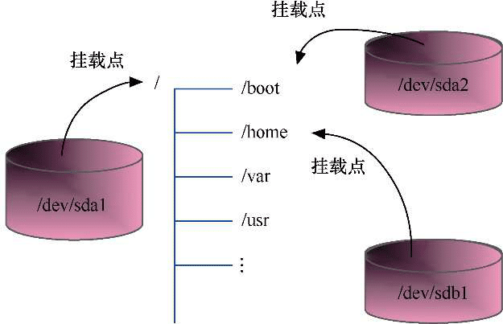

# 挂载存储设备

通过之前的操作，已经将系统中新增加的第二块硬盘（10G）分成了 4 个分区：/dev/sdb1、/dev/sdb4、/dev/sdb5 和/dev/sdb6，其中/dev/sdb4 作为扩展分区无法使用，实际可用的分区只有 3 个。

但是，上述这 3 个分区也无法直接使用。要想使用这些分区，还必须要经过最后一步操作——挂载。

在 Linux 系统中，对各种存储设备的资源访问（如读取、保存文件等）都是通过目录结构进行的，虽然系统核心能够通过设备文件操纵各种设备，但是对于用户来说，还需要有一个`挂载`的过程，才能像正常访问目录一样访问存储设备中的资源。

下面将详细介绍如何挂载以及卸载硬盘分区、光盘、U 盘和 ISO 镜像等各种存储设备。

## 什么是挂载

挂载就是指定系统中的一个目录作为挂载点，用户通过访问这个目录来实现对硬盘分区的数据存取操作，作为挂载点的目录就相当于是一个访问硬盘分区的入口。挂载这个操作就是用来告诉 Linux 系统：现在有一个磁盘空间，请你把它放在某一个目录中，好让用户可以调用里面的数据。挂载时必须以设备文件来指定所要挂载的设备。

例如，把/dev/sdb5 挂载到/tmp 目录，当用户在/tmp 目录下执行数据存取操作时，Linux 系统就知道要到/dev/sdb5 上执行相关的操作。

在安装 Linux 系统的过程中，自动建立或识别的分区通常会由系统自动完成挂载，如`/`分区、`/boot`分区等，如图所示，后来新增加的硬盘分区、U 盘、光驱等设备，就必须由管理员手动进行挂载。



挂载使用命令 mount，命令的基本格式如下：

```text
mount [-t 文件系统类型] 设备文件名 挂载点目录
```

其中，文件系统类型通常可以省略（由系统自动识别）；设备文件名则应区分每种设备所对应的名字，这里也可以是一个网络资源路径；挂载点为用户指定用于挂载的目录。需要注意的是，作为挂载点的目录必须是事先已经存在的。

卸载使用的命令为 umount，需要指定挂载点目录或对应的设备文件名作为参数，命令格式如下：

```text
umount 设备文件名|挂载点目录
```

## 挂载硬盘分区

下面新建一个目录/data，并将硬盘分区`/dev/sdb1`挂载到`/data`目录下。

```shell
[root@localhost ~]# mkdir /data
[root@localhost ~]# mount /dev/sdb1 /data
```

需要注意的是，挂载点必须是一个已经存在的目录，一般在挂载之前先创建一个新目录。如果要把现有的目录当作挂载点，则这个目录最好为空目录，但挂载之后目录里原有的内容也不受影响。

将`/dev/sdb5`挂载到`/backup`目录，挂载之后，目录中原有的内容仍然被保留在原先的磁盘分区中：

```shell
[root@spider ~]# mkdir /backup
[root@spider ~]# cd /backup
[root@spider backup]# touch test
[root@spider backup]# ls
test
[root@spider backup]# mount /dev/sdb5 /backup
[root@spider backup]# ls
test
```

将设备卸载之后，`/backup`目录原来的文件也不会受到影响。

```shell
[root@localhost ~]# umount /backup
[root@localhost ~]# ls /backup
test
```

在 Linux 系统中，已经提供了两个默认的挂载点目录：/media 和/mnt。/media 用作系统自动挂载点，/mnt 用作用户手动挂载点。例如，当在图形界面下插入 U 盘或光盘时，系统会将它们自动挂载到/media 目录下；而如果用户要手动挂载这些设备，则建议挂载到/mnt 目录下。另外，不建议将设备直接挂载到/mnt 目录之下，而应先在其中创建子目录，然后分别将不同的设备挂载到相应的子目录中。例如，创建目录/mnt/game 和/mnt/movie，将/dev/sdb5 和/dev/sdb6 分区分别挂载到这两个目录下。

```shell
[root@localhost ~]# mkdir /mnt/{game,movie}
[root@localhost ~]# mount /dev/sdb5 /mnt/game
[root@localhost ~]# mount /dev/sdb6 /mnt/movie
```

## 查看系统中已挂载的设备

通过 df（disk free）命令可以查看系统中已经挂载的设备，并了解这些设备的使用情况。df 命令的常用选项有`-h`和`-T`。

- `-h`选项：人性化显示，显示 K（KB）、M（MB）、G（GB）等更易读的容量单位。
- `-T`选项：显示文件系统的类型。

例如，查看系统中已经挂载的设备及其使用情况。

```shell
[root@localhost ~]# df -hT
```

在执行 df 命令时，会看到有许多类型为 tmpfs 的文件系统，这些都是 Linux 中的临时文件系统，一般可以忽略它们。为了方便显示，可以通过执行``df -hT | grep -v tmpfs``命令来过滤掉这些临时文件系统。

## 挂载光驱

在挂载光驱和 U 盘等外围设备时，一般习惯将挂载点放在/mnt 目录下。

光驱对应的设备文件通常为`/dev/cdrom`，首先在虚拟机中加载系统光盘 ISO 镜像，然后将光驱挂载到`/mnt/cdrom`目录。由于光盘是只读的存储介质，因此在挂载时系统会出现写保护的提示信息。

```shell
[root@localhost ~]# mkdir /mnt/cdrom
[root@localhost ~]# mount /dev/cdrom /mnt/cdrom
mount: /mnt/cdrom: WARNING: source write-protected, mounted read-only.
```

查看系统中已挂载的存储设备。从 df 命令显示的结果中可以发现，光驱的实际设备文件是/dev/sr0，/dev/cdrom 其实只是一个符号链接，不过我们一般习惯用/dev/cdrom 这个更容易记忆的名字。光盘的文件系统是 iso9660，这个了解即可。

```shell
[root@localhost ~]# df -hT
文件系统            类型      容量  已用  可用 已用% 挂载点
……
/dev/sr0            iso9660   7.9G  7.9G     0  100% /mnt/cdrom
```

## 挂载移动存储设备

U 盘和移动硬盘等使用 USB 接口的移动存储设备在 Linux 系统中也是采用/dev/sdx 的命名方式。下面以 U 盘为例介绍如何挂载使用移动存储设备。

插入 U 盘，用`fdisk -l`命令查看新插入的 U 盘，它对应的设备文件为`/dev/sdc`:

```shell
[root@localhost ~]# fdisk -l
磁盘 /dev/sdc：7901 MB, 7901020160 字节，15431680 个扇区
Units = 扇区 of 1 * 512 = 512 bytes
扇区大小(逻辑/物理)：512 字节 / 512 字节
I/O 大小(最小/最佳)：512 字节 / 512 字节
磁盘标签类型：dos
磁盘标识符：0x00000000
设备 Boot      Start         End      Blocks      d      System
/dev/sdc1      8192    15431679      711744      b    W95 FAT32
```

可以看到，U 盘只有一个分区/dev/sdc1，下面将它挂载到`/mnt/usb`目录中。

```shell
[root@localhost ~]# mkdir /mnt/usb
[root@localhost ~]# mount /dev/sdc1 /mnt/usb
```

## 挂载 ISO 镜像

如今 ISO 镜像使用的频率越来越高，因为光驱已逐渐被淘汰。在 Linux 系统中，可以将 ISO 镜像直接挂载使用。Linux 将 ISO 镜像视为一种特殊的`回环`文件系统，因此在挂载时需要添加`-o loop`选项。

下面将 U 盘中事先准备好的 Kali Linux 系统的镜像文件`kali-linux-2.0-amd64.iso`挂载到`/mnt/kali`目录中。

```shell
[root@localhost ~]# mkdir /mnt/kali
[root@localhost ~]# cd /mnt/usb
[root@localhost usb]# mount -o loop kali-linux-2.0-amd64.iso /mnt/kali
```

## 卸载存储设备

在卸载存储设备时，因为同一设备可能被挂载到多个目录下，所以一般建议通过挂载点目录的位置来进行卸载。

例如，将挂载到/mnt/cdrom 目录的光驱卸载。

```shell
[root@localhost ~]# umount /mnt/cdrom
```

在使用 umount 命令卸载存储设备时，必须保证此时存储设备不能处于 busy 状态。使存储设备处于 busy 状态的情况包括设备中有打开的文件，某个进程的工作目录在此系统中，设备的缓存文件正在被使用等。常见的错误是在挂载点目录下进行卸载操作。

例如，在挂载点目录下进行卸载操作，出现错误提示。

```shell
[root@localhost ~]# cd /mnt/cdrom
[root@localhost cdrom]# umount /mnt/cdrom
umount: /mnt/cdrom：目标忙。
     (有些情况下通过 lsof(8) 或 fuser(1) 可以找到有关使用该设备的进程的有用信息)
```

此时只要从挂载点目录中退出，就可以正常卸载了。

## 自动挂载

通过 mount 命令所挂载的存储设备在 Linux 系统关机或重启时都会自动被卸载，这样每次开机后管理员都需要将它们手工再挂载一遍。如果在挂载的存储设备里存放了一些开机要自动运行的程序数据，则可能会导致程序出现错误。在 Linux 系统中，可以通过修改/etc/fstab 文件来完成存储设备的自动挂载。

/etc/fstab 被称为文件系统数据表（File System Table），Linux 在每次开机的时候都会按照这个文件中的配置来自动挂载相应的存储设备。/etc/fstab 文件中的内容如下所示：

```shell
[root@spider ~]# cat /etc/fstab
#
# /etc/fstab
# Created by anaconda on Fri Mar 25 00:51:54 2022
#
# Accessible filesystems, by reference, are maintained under '/dev/disk/'.
# See man pages fstab(5), findfs(8), mount(8) and/or blkid(8) for more info.
#
# After editing this file, run 'systemctl daemon-reload' to update systemd
# units generated from this file.
#
/dev/mapper/cs-root     /                       xfs     defaults        0 0
UUID=fd75174a-d540-45ac-8a2b-1861df9d98c7 /boot                   xfs     defaults        0 0
/dev/mapper/cs-swap     none                    swap    defaults        0 0
```

文件中的每一行对应了一个自动挂载的设备，每行包括 6 个字段，每个字段的含义如下：

- 第 1 个字段：需要挂载的设备文件名，也可以写成分区的 LABEL（卷标）或者分区的 UUID。
- 第 2 个字段：挂载点。挂载点必须是一个目录，而且必须用绝对路径。
- 第 3 个字段：文件系统的类型。如果是 XFS 文件系统，则写成 xfs；如果是 EXT4 文件系统，则写成 ext4；如果是光盘，则写成 auto，由系统自动检测。
- 第 4 个字段：挂载选项。选项非常多，这里一般采用`defaults`，表示包含 rw、suid、dev、exec、auto、nouser、async 等选项。
- 第 5 个字段：存储设备是否需要 dump 备份（dump 是一个备份工具），1 表示需要，0 表示忽略。现在很少用到 dump 这个工具，这项通常设置为 0。
- 第 6 个字段：表示在系统启动时是否检测这个存储设备以及检测的顺序。0 表示不检测；1 和 2 表示检测以及检测的顺序，先检测 1，再检测 2。如果有多个分区需要开机检测，就都设置成 2，1 检测完后会检测 2。在 CentOS 7 系统中，该项通常设置为 0。

下面我们通过修改/etc/fstab 文件分别来实现磁盘分区和光驱的自动挂载。

例如，将磁盘分区/dev/sdb1 自动挂载到/data 目录。

利用 Vi 编辑器修改/etc/fstab 文件，在文件的最下方增加下面一行。

```shell
[root@localhost ~]# vim /etc/fstab
/dev/sdb1               /data             xfs    defaults        0 0
```

例如，将光驱自动挂载到/mnt/cdrom 目录。

```shell
[root@localhost ~]# vim /etc/fstab
/dev/cdrom             /mnt/cdrom        auto    defaults        0 0
```

通过修改/etc/fstab 配置文件，虽然可以实现设备的永久挂载，但是却无法立即生效。这也是 Linux 系统中很多操作的共同特点：同样一种功能，比如挂载存储设备，如果是通过命令来实现，那么可以立即生效，但无法永久有效，当系统关机或重启之后功能就失效了；而如果通过修改配置文件的方式来实现该功能，可以永久有效，但无法立即生效，一般会在重启系统的时候生效。

因而当修改完/etc/fstab 文件之后，我们可以执行`mount –a`命令，它可以自动挂载配置文件中所有的文件系统，从而在无须重启系统的情况下使得设置生效。

另外，还需要注意一个问题，像/dev/sdb1 这类由系统自动分配的设备名称并非总是固定不变的，它们依赖于系统启动时内核加载模块的顺序。例如，我们在插入 U 盘时启动了系统，而下次启动时又把 U 盘拔掉了，就有可能会导致设备名分配不一致。因此，在/etc/fstab 文件中自动挂载存储设备时，最好采用 UUID 来表示所要挂载的设备。UUID（Universally Unique IDentifier，全局唯一标识符）是 Linux 系统为每个设备提供的唯一标识字符串，系统并非通过名称而是通过 UUID 来识别每个存储设备，而且 UUID 不会发生改变。用户可以通过 blkid 命令来查看某个设备的 UUID，例如查看/dev/sdb1 的 UUID：

```shell
[root@localhost ~]# blkid /dev/sdb1
/dev/sdb1: UUID="b19f830c-4ffb-4477-843c-1acabec651a1" BLOCK_SIZE="512" TYPE="xfs" PARTUUID="61ea98ea-01"
```

在/etc/fstab 文件中采用 UUID 来表示/dev/sdb1。

```shell
[root@localhost ~]# vim /etc/fstab
UUID=b19f830c-4ffb-4477-843c-1acabec651a1   /data   xfs   defaults   0 0
```
