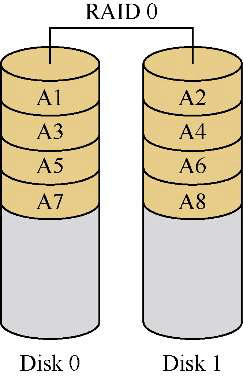
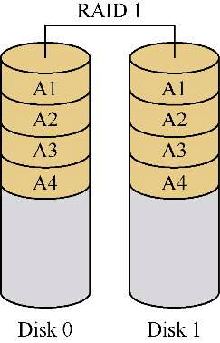
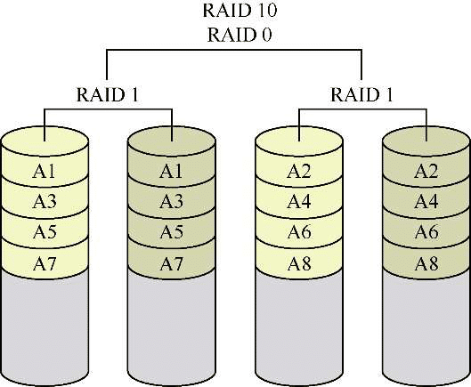
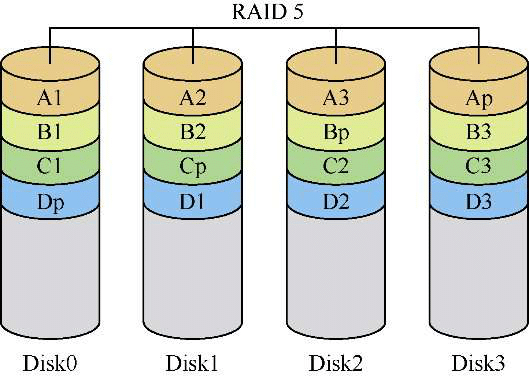

# 磁盘阵列管理（RAID）

计算机硬件技术发展迅猛，CPU处理器平均每年可提升30%～50%的计算性能，但由于受自身工作特性所限，传统的机械硬盘性能提升非常缓慢，它已成为制约计算机整体性能的瓶颈。虽然采用固态硬盘可以提高性能，但是由于固态硬盘的可靠性较低，同时受制于成本，因此在目前的服务器中广泛采用的仍然是传统的机械硬盘。

另外，在服务器中，往往集中存储了网络中的大量关键数据。企业网络中的数据可以分为操作系统数据和应用程序数据，关键数据主要是指应用程序数据。这些数据一般需要集中存储和备份。

如何既能提高硬盘性能，又能增强数据存储的安全性？一种行之有效并且广泛采用的方案就是将多块硬盘组成RAID。在服务器中，通常会安装多块硬盘，将这些硬盘组成不同级别的RAID，就可以达到增强数据安全性或提高硬盘性能的目的。

## 什么是RAID

RAID（Redundant Array of Independent Disks，独立冗余磁盘阵列）简称磁盘阵列，是一种把多块独立的硬盘按不同的方式组合起来形成一个硬盘组，从而提供比单个硬盘更高的存储性能和数据备份的技术。

从用户的角度来看，组成的硬盘组就像是一个硬盘，用户可以对它进行分区、格式化等，对磁盘阵列的操作与单个硬盘基本一样。不同的是，磁盘阵列的读写速度要比单个硬盘高很多，而且可以提供自动数据备份功能。

RAID技术的两大特点：一是速度，二是安全。有时我们希望提高硬盘的工作速度，有时我们希望提高数据的安全性，更多的情况下我们希望二者兼得，因此，按照不同的用户需求，RAID提供了很多种不同的组合方式，这些组成磁盘阵列的不同方式就称为RAID级别。常用的RAID级别主要包括RAID 0、RAID 1、RAID 10（RAID 1+0）和RAID 5。每种RAID级别都具有相应的技术特点，有的RAID级别可以提高硬盘工作速度，有的RAID级别可以提高数据的安全性，还有的RAID级别可以在提高硬盘速度的同时增强数据的安全性。

1．RAID 0

RAID 0级别专用于提升硬盘工作速度，要组建RAID 0至少要用两块硬盘。

组成RAID 0之后，数据并不是保存在一块硬盘上，而是分成数据块保存在不同的硬盘。在进行数据读写操作时，对这两块硬盘同时操作，从而大幅提高硬盘工作性能，其效果示意图如图所示：



在所有的RAID级别中，RAID 0的存取速度最快，磁盘利用率也最高，缺点是没有冗余功能，也就是无法提高数据的安全性，阵列中的任何一块硬盘损坏，都将导致所有的数据无法使用。RAID0主要适用于对性能要求较高，而对数据安全要求低的领域。

2．RAID 1

RAID 1由两块硬盘实现，它的原理是将用户写入其中一块硬盘中的数据原样地自动复制到另外一块硬盘。当读取数据时，系统先从RAID 1的源盘读取数据，如果读取数据成功，则系统不去管备份盘上的数据；如果读取源盘数据失败，则系统自动转而读取备份盘上的数据，从而避免造成用户工作任务的中断。RAID 1效果如图所示：



在所有的RAID级别中，RAID 1提供了很高的数据安全保障，但因为其写入速率低，存储成本高，所能使用的空间只是所有磁盘容量总和的一半，所以主要用于存放重要数据。

3．RAID 10

RAID 10是RAID 1和RAID 0的组合形式，也称为RAID 1+0，需要由4块硬盘实现，如图所示。4块硬盘先分别两两组成RAID 1硬盘组，以保证数据的安全性，然后将两个RAID 1硬盘组组成RAID 0，以提高读写速度，这样理论上只要不是同一组中的所有硬盘全部损坏，那么最多允许损坏50%的硬盘而不丢失数据。



RAID 10既具有出色的读写性能，又具有非常高的安全性。但是，其存储成本高，磁盘空间利用率与RAID 1相同，只有50%。由于在绝大部分情况下相比硬盘的价格，我们更加在乎的是数据的价值，因此RAID 10在生产环境中被广泛应用。

4．RAID 5

RAID 5是由至少3块硬盘组成的磁盘阵列，将数据分布于不同的硬盘上，并在所有硬盘上交叉地存取数据及奇偶校验信息。下图是由4块硬盘组成的RAID 5，当第一次执行写入操作的时候，将数据A1、A2、A3分别写入到Disk0、Disk1、Disk2这3块硬盘中，同时将由这些数据产生的奇偶校验信息Ap存储到Disk3硬盘中。第二次执行写入操作的时候，再将奇偶校验信息存储到Disk2硬盘中，在其余3块硬盘中存储数据，依此类推。这样当阵列中的任何一块硬盘损坏时，都可以从其他硬盘中将数据恢复回来。



采用RAID 5时，数据存储相对比较安全，可以允许有一块硬盘损坏；同时数据读取速率较高，但写入速率较低；磁盘利用率为(n−1)/n，其中n为磁盘数。相比RAID 10，RAID 5是一种比较妥协的方案，兼顾了存储设备性能、数据安全性与存储成本问题，因而在生产环境中也被广泛采用。

不同RAID级别的特性对比见下表：

| RAID级别       | RAID 0    | RAID 1  | RAID 10   | RAID 5                |
| -------------- | --------- | ------- | --------- | --------------------- |
| 磁盘数         | 2个或更多 | 只需2个 | 4个或多个 | 3个或多个             |
| 容错功能       | 无        | 有      | 有        | 有                    |
| 读写速度       | 最快      | 较慢    | 快        | 快                    |
| 磁盘空间利用率 | 100%      | 50%     | 50%       | (n-1)/n，其中n为磁盘数 |

## RAID实现方式

RAID在实现方式上分为软件RAID和硬件RAID两种类型。

软件RAID通过系统功能或者RAID软件来实现，没有独立的硬件和接口，需要占用一定的系统资源，并且受到操作系统稳定性的影响。在现有的操作系统中，如Windows和Linux等已经集成了软件RAID的功能。软件RAID的优点是实现简单，不需要额外的硬件设备。

硬件RAID通过独立的RAID硬件卡实现，目前绝大多数的服务器配置了RAID卡或在主板上集成了RAID控制芯片，因而可以实现硬RAID。硬件RAID不需要占用其他硬件资源，稳定性和速度都比软件RAID要好，因此，对于服务器来说，推荐使用硬件RAID来提高性能。

在我们的实验环境中，可以通过CentOS 7系统提供的软件RAID功能来熟悉一下RAID技术，其中的理论知识和操作过程与生产环境基本一致。在操作过程中所涉及的命令，只需了解其基本用法，不需要深入掌握，因为软件RAID在生产环境中很少使用。

首先，我们需要在虚拟机中除原有的系统盘之外再额外添加4块20G的硬盘，然后，将虚拟机重启以识别新增加的硬盘。

## 配置RAID 10

在Linux中创建磁盘阵列可以使用mdadm命令。mdadm是multi disks admin的缩写，即多磁盘管理。在CentOS 7中，支持4种RAID级别。下面以RAID 10和RAID 5为例来介绍软件RAID的设置方法。

mdadm命令的基本格式如下：

```
mdadm  [mdadm  []  RAID设备名称  选项  成员设备名称
```

例如，创建一个名为/dev/md0的软件RAID，级别为10，包括/dev/sdb、/dev/sdc、/dev/sdd和/dev/sde共4块硬盘。

```
[root@localhost ~]# mdadm -C /dev/md0 -a yes -n 4 -l 10 /dev/sd{b,c,d,e}
    mdadm: Defaulting to version 1.2 metadata
    mdadm: array /dev/md0 started.
```

这条命令中所涉及的选项及参数的含义如下：

- -C /dev/md0：`-C`选项用于指定当前的操作模式为创建模式，在后面要指定设备名称，/dev/md0就是所创建的RAID的名称，名称可以任意设置，通常习惯采用mdn（n为磁盘阵列的序号）的形式表示。
- -a yes：自动创建相关设备文件。
- -n 4：指定创建磁盘阵列所使用的硬盘个数。
- -l 10：指定RAID 10级别。

创建好磁盘阵列之后，可以执行`cat /proc/mdstat`命令查看内存中的磁盘阵列信息。如果可以查看到相关信息，就证明系统已经成功识别了我们所创建的磁盘阵列。

```
[root@localhost ~]# cat /proc/mdstat
Personalities : [raid10] [raid6] [raid5] [raid4]
md0 : active raid10 sde[3] sdd[2] sdc[1] sdb[0]
      41908224 blocks super 1.2 512K chunks 2 near-copies [4/4] [UUUU]
unused devices: <none>
```

另外，也可以通过mdadm命令的`-D`选项来查看磁盘阵列的详细信息，其中的注释是对其中一些关键信息的说明。

```
[root@localhost ~]# mdadm -D /dev/md0
/dev/md0:
        Version : 1.2
  Creation Time : Sat Oct  7 07:51:11 2017
     Raid Level : raid10                               #RAID级别
     Array Size : 41910272 (39.97 GiB 42.92 GB)        #RAID磁盘空间
  Used Dev Size : 20955136 (19.98 GiB 21.46 GB)
   Raid Devices : 4                                    #磁盘个数
   Total Devices : 4
    Persistence : Superblock is persistent
    Update Time : Sat Oct  7 07:54:41 2017
          State : clean
 Active Devices : 4                                    #活动磁盘个数
 Working Devices : 4                                   #工作磁盘个数
 Failed Devices : 0                                    #错误磁盘个数
 Spare Devices : 0                                     #备用磁盘个数
         Layout : near=2
     Chunk Size : 512K
           Name : Server:0  (local to host Server)
           UUID : fa5bf115:23c2ebfe:d8dc1a82:a4f5ecce
         Events : 17
    Number   Major   Minor   RaidDevice State
       0       8       16        0      active sync set-A   /dev/sdb
       1       8       32        1      active sync set-B   /dev/sdc
       2       8       48        2      active sync set-A   /dev/sdd
       3       8       64        3      active sync set-B   /dev/sde
```

接下来我们就可以像之前对普通硬盘进行的操作一样，对磁盘阵列进行格式化和挂载等操作。

例如，将磁盘阵列格式化为XFS文件系统。

```
[root@localhost ~]# mkfs -t xfs /dev/md0
meta-data=/dev/md0           isize=512    agcount=16, agsize=654720 blks
         =                   sectsz=512   attr=2, projid32bit=1
         =                   crc=1        finobt=0, sparse=0
data     =                   bsize=4096   blocks=10475520, imaxpct=25
         =                   sunit=128    swidth=256 blks
naming   =version 2          bsize=4096   ascii-ci=0 ftype=1
log      =internal log       bsize=4096   blocks=5120, version=2
         =                   sectsz=512   sunit=8 blks, lazy-count=1
realtime =none               extsz=4096   blocks=0, rtextents=0
```

创建挂载点后挂载磁盘阵列，并查看已经挂载的设备。

```
[root@Server ~]# mkdir /raid
[root@Server ~]# mount /dev/md0 /raid
[root@Server ~]# df -hT | grep -v tmpfs
文件系统                        类型       容量   已用  可用  已用%  挂载点
/dev/mapper/cl_localhost-root  xfs       17G  3.8G   14G   22%   /
/dev/sda1                      xfs     1014M  173M  842M   18%   /boot
/dev/md0                       xfs       40G   33M   40G    1%   /raid
```

## RAID性能测试

虽然软件RAID在性能提升方面较硬件RAID有很大差距，但其与普通硬盘相比，在读写速度上依然有很大的提高。下面采用dd命令来进行测试验证。

从设备文件/dev/zero中复制数据到/tmp/test1文件，读取500个大小为1MB的数据块。可以看出，对普通磁盘写入500MB数据，平均速度为89.4 MB/s。

```
[root@localhost ~]# dd if=/dev/zero of=/tmp/test1 bs=1M count=500
记录了500+0 的读入
记录了500+0 的写出
524288000字节(524 MB)已复制，5.86282 s，89.4 MB/s
```

下面再对磁盘阵列进行同样的写入操作，平均速度大幅提升到了619 MB/s，性能得到明显改善。

```
[root@localhost ~]# dd if=/dev/zero of=/raid/test2 bs=1M count=500
记录了500+0 的读入
记录了500+0 的写出
524288000字节(524 MB)已复制，0.847297 s，619 MB/s
```

## RAID故障模拟

下面我们再来模拟当磁盘阵列中的某块硬盘损坏之后，如何进行修复。

首先向/raid目录中随意复制一个文件，并测试可以正常打开。

```
[root@localhost ~]# cp /etc/passwd /raid
```

然后通过mdadm命令的`-f`选项可以将阵列中的某块硬盘标记为损坏。

```
[root@localhost ~]# mdadm /dev/md0 -f /dev/sdb
mdadm: set /dev/sdb faulty in /dev/md0
```

此时查看磁盘阵列的详细信息，可以看到提示有一块硬盘损坏。

```
[root@localhost ~]# mdadm -D /dev/md0
/dev/md0:
……
  Active Devices : 3
Working Devices : 3
 Failed Devices : 1                            #错误磁盘个数为1
  Spare Devices : 0
……
    Number   Major   Minor   RaidDevice State
       -       0        0        0      removed
       1       8       32        1      active sync set-B   /dev/sdc
       2       8       48        2      active sync set-A   /dev/sdd
       3       8       64        3      active sync set-B   /dev/sde
```

但我们之前存放在磁盘阵列中的测试文件/raid/passwd仍然完好，也可以继续在磁盘阵列中正常地读写文件。因而证明在RAID 10级别的磁盘阵列中，存在一个故障盘并不影响使用。

下面通过mdadm命令的`-r`选项将损坏的硬盘从阵列中移除。

```
[root@localhost ~]# mdadm /dev/md0 -r /dev/sdb
mdadm: hot removed /dev/sdb from /dev/md0
```

当购买了新的硬盘之后，可以再使用mdadm命令的`-a`选项将新硬盘加入磁盘阵列中。

```
[root@localhost ~]# mdadm /dev/md0 -a /dev/sdb
mdadm: added /dev/sdb
```

此时查看磁盘阵列的详细信息，可以看到正在重建数据，重建完成之后，磁盘阵列恢复正常。

```
[root@localhost ~]# mdadm -D /dev/md0
/dev/md0:
  ……
 Active Devices : 3
Working Devices : 4
 Failed Devices : 0
  Spare Devices : 1
   Rebuild Status : 8% complete
……
    Number   Major   Minor   RaidDevice State
       4       8       16        0      spare rebuilding    /dev/sdb
       1       8       32        1      active sync set-B   /dev/sdc
       2       8       48        2      active sync set-A   /dev/sdd
       3       8       64        3      active sync set-B   /dev/sde
```

## 配置RAID 5和备份盘

RAID 10最多允许损坏50%的硬盘设备，但如果在极端情况下，同一组中的硬盘同时全部损坏，那么也会导致数据丢失。例如，当RAID10磁盘阵列中某一块硬盘出现了故障，运维人员正在修复时，恰巧此时同组中的另一块硬盘设备也出现故障，那么数据就被彻底损坏了。如果为磁盘阵列配备一块备份盘，就可以预防这类情况发生。备份盘是在磁盘阵列之外添加的一块硬盘，平时处于闲置状态，一旦RAID磁盘阵列中有硬盘出现故障，就会马上自动顶替上去。

下面通过设置RAID 5加备份盘来予以说明，其中RAID 5使用3块硬盘，第4块硬盘作为备份盘。

利用mdadm命令的`-S`选项将之前创建的RAID 10阵列停用，在停用之前应先将其卸载。

```
[root@localhost ~]# umount /raid
[root@localhost ~]# mdadm -S /dev/md0
mdadm: stopped /dev/md0
```

下面创建一个名为/dev/md1的RAID5磁盘阵列，同时通过`-x`选项指定一个备份盘，这样系统会自动将最后一个硬盘/dev/sde作为备份盘使用。由于曾经使用这些硬盘创建过磁盘阵列，因此系统会提示所指定的硬盘曾在别的阵列中被使用，需要确认之后才能继续用它们组建新的磁盘阵列。

```
[root@localhost ~]# mdadm -C /dev/md1 -a yes -n 3 -l 5 -x 1 /dev/sd{b,c,d,e}
mdadm: /dev/sdb appears to be part of a raid array:
       level=raid10 devices=4 ctime=Sat Oct 14 15:23:04 2017
mdadm: /dev/sdc appears to be part of a raid array:
       level=raid10 devices=4 ctime=Sat Oct 14 15:23:04 2017
mdadm: /dev/sdd appears to be part of a raid array:
       level=raid10 devices=4 ctime=Sat Oct 14 15:23:04 2017
mdadm: /dev/sde appears to be part of a raid array:
       level=raid10 devices=4 ctime=Sat Oct 14 15:23:04 2017
Continue creating array? (y/n) y
mdadm: Defaulting to version 1.2 metadata
mdadm: array /dev/md1 started.
```

命令中涉及的选项和参数如下：

- -l 5：指定磁盘阵列的级别。
- -x 1：指定有1块备份盘。

创建RAID 5阵列之后，需要有一个重建数据的过程，然后查看阵列的详细信息，就能看到有一块备份盘处于闲置（等待）状态。

```
[root@localhost ~]# mdadm -D /dev/md1
/dev/md1:
……
 Active Devices : 3
Working Devices : 4
 Failed Devices : 0
  Spare Devices : 1        #提示有一块硬盘处于闲置（等待）状态
……
    Number   Major   Minor   RaidDevice State
       0       8       16        0      active sync   /dev/sdb
       1       8       32        1      active sync   /dev/sdc
       4       8       48        2      active sync   /dev/sdd
       3       8       64        -      spare         /dev/sde
```

将磁盘阵列格式化之后，除使用mount命令之外，也可以通过修改/etc/fstab配置文件的方法来挂载磁盘阵列，同样这里也推荐采用UUID的方式来表示磁盘阵列。

```
[root@localhost ~]# mkfs -t xfs /dev/md1
[root@localhost ~]# blkid /dev/md1    #查看磁盘阵列的UUID
/dev/md1: UUID="8e71b383-21be-479f-8450-72c777d2e4a8" TYPE="xfs"
[root@localhost ~]# echo 'UUID=8e71b383-21be-479f-8450-72c777d2e4a8 /raid xfs defaults 0 0' >> /etc/fstab        #将挂载信息添加到fstab文件中
[root@localhost ~]# mount -a
[root@localhost ~]# df -hT | grep -v tmpfs
文件系统                  类型        容量   已用  可用  已用%  挂载点
/dev/mapper/cl_localhost-root xfs         17G  3.5G   14G   21% /
/dev/sda1                xfs      1014M  173M  842M   18%   /boot
/dev/md1                 xfs        40G   33M   40G    1%   /raid
```

然后再次把硬盘/dev/sdb标记为损坏，并移出磁盘阵列。查看/dev/md1磁盘阵列的详细信息会发现，备份盘已经被自动顶替上去，并正在重建数据。数据重建完成后，磁盘阵列恢复正常。

```
[root@localhost ~]# mdadm /dev/md1 -f /dev/sdb    #将sdb硬盘标记为损坏
mdadm: set /dev/sdb faulty in /dev/md1
[root@localhost ~]# mdadm /dev/md1 -r /dev/sdb
mdadm: hot removed /dev/sdb from /dev/md1
[root@localhost ~]# mdadm -D /dev/md1
/dev/md1:
……
 Active Devices : 2
Working Devices : 3
 Failed Devices : 0
  Spare Devices : 1
……
    Number   Major   Minor   RaidDevice State
       3       8       64        0      spare rebuilding   /dev/sde
       1       8       32        1      active sync   /dev/sdc
       4       8       48        2      active sync   /dev/sdd
```
