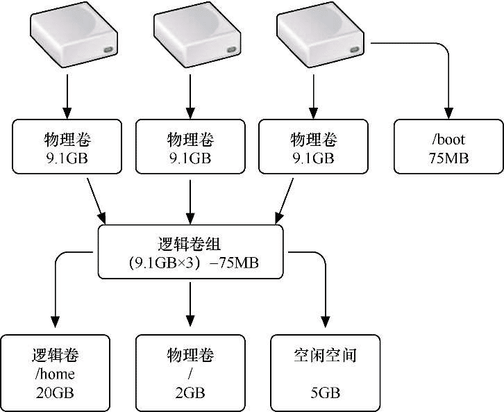

# 逻辑卷管理（LVM）

逻辑卷管理（LVM）是 Linux 系统中比较重要的一种磁盘管理机制，管理员利用 LVM 可以在磁盘不用重新分区的情况下动态调整文件系统的大小，并且利用 LVM 管理的文件系统可以跨越磁盘。

例如，系统中的 sda1 分区原先分配的容量是 100GB，在使用了一段时间之后，发现容量不够用了。如果采用传统的磁盘管理机制，只能将 sda 硬盘重新分区，并给 sda1 分区分配更大的空间，但这样不可避免地会造成数据丢失，影响服务器的正常使用。如果采用 LVM 机制，就可以在保证系统正常运行的前提下，随时为 sda1 分区增大空间，而且即使该分区所在的硬盘 sda 没有多余的空间可用，也可以随时为服务器添加新的硬盘，并将新硬盘上的空间扩展到 sda1 分区中。当然，这里采用 sda 和 sda1 的方式来进行描述，只是为了便于我们理解。当采用 LVM 机制之后，传统意义上的硬盘会被组合成卷组（VG），然后从卷组中划分出逻辑卷（LV）来使用，逻辑卷就相当于传统意义上的磁盘分区。

总之，LVM 为我们提供了逻辑概念上的磁盘，使得文件系统不再关心底层物理磁盘的概念。LVM 的出现实现了磁盘空间的动态调整和按需分配。

## LVM 的相关概念

逻辑卷管理（Logical Volume Manager，LVM）是建立在物理磁盘和分区之上的一个逻辑层，通过它可以将若干个磁盘分区组合为一个整体的卷组，形成一个存储池。在卷组中可以任意创建逻辑卷，并进一步在逻辑卷上创建文件系统，最终在系统中挂载使用的就是逻辑卷。逻辑卷的使用方法与普通的磁盘分区完全一样。

在 LVM 中，主要涉及以下几个概念。

-   物理卷（Physical Volume，PV）是构建 LVM 的基础，通常就是指磁盘或磁盘分区。实现 LVM 的第一步，就是将原先的普通磁盘或磁盘分区转换为 LVM 物理卷。在转换为物理卷之后，就可以像搭积木一样对它们进行灵活的组合和拆分了。
-   卷组（Volume Group，VG）是一个存储池，它是 LVM 逻辑概念上的磁盘设备，可以将多个物理卷组合成卷组。卷组的大小取决于物理卷的容量和个数。
-   逻辑卷（Logical Volume，LV）是 LVM 逻辑意义上的磁盘分区，我们可以指定从卷组中提取多少容量来创建逻辑卷，最后对逻辑卷进行格式化并挂载使用。
-   物理块（Physical Extent，PE）是将物理卷组合为卷组后所划分的最小存储单位，即逻辑意义上磁盘的最小存储单元。PE 的大小是可配置的，默认为 4MB。

LVM 各组成部分之间的对应关系如图所示。从图中可以看出，我们将物理磁盘或磁盘分区转换为 LVM 的物理卷，多个物理卷组合为卷组，逻辑卷就是从卷组中提取出来的存储空间，最后我们将逻辑卷挂载到某个挂载点目录上。需要注意的是，由于`/boot`目录用于存放系统引导文件，因此不能应用 LVM 机制。



## 系统默认 LVM 设置

在 CentOS 7 系统中，LVM 得到了高度重视。例如，在安装系统的过程中，如果由系统自动进行分区，则系统除创建一个`/boot`引导分区之外，会对剩余的磁盘空间全部采用 LVM 机制。

执行 pvs 命令可以显示系统中目前已有的物理卷简要信息，可以看到硬盘分区/dev/sda2 已经变成了物理卷。

```shell
[root@localhost ~]# pvs
  PV         VG         Fmt      Attr     PSize      PFree
  /dev/sda2  centos     lvm2     a--      <19.00g    0
```

执行 vgs 命令可以查看卷组简要信息，系统默认创建了一个名为 centos 的卷组，其中包括 1 个 PV（物理卷），卷组容量为 19GB。

```shell
[root@localhost ~]# vgs
  VG      #PV  #LV  #SN  Attr   VSize   VFree
  centos   1    2    0   wz--n-  <19.00g    0
```

执行 lvs 命令可以查看逻辑卷简要信息，系统在 centos 卷组中创建了两个逻辑卷。一个逻辑卷名为 root，容量约为 17GB；另一个逻辑卷名为 swap，容量为 2GB。

```shell
[root@localhost ~]# lvs
  LV   VG    Attr     LSize   Pool Origin Data%  Meta%  Move Log Cpy%Sync Convert
  root centos  -wi-ao---- <17.00g
  swap centos  -wi-ao---- 2.00g
```

名为 swap 的逻辑卷作为交换分区使用，名为 root 的逻辑卷则被挂载到了根目录，成为了根分区。执行 df 命令可以看到，被挂载到根目录的逻辑卷设备文件名为/dev/mapper/centos-root。

```shell
[root@localhost ~]# df -hT | grep -v tmpfs
文件系统                   类型      容量  已用   可用  已用%  挂载点
/dev/mapper/centos-root   xfs      17G  4.3G   13G   26%   /
/dev/sda1                 xfs    1014M  157M  858M   16%   /boot
```

查看设备文件/dev/mapper/centos-root 的详细信息，可以看到这是一个软链接，所指向的源文件为/dev/dm-0。

```shell
[root@localhost ~]# ll /dev/mapper/centos-root
lrwxrwxrwx. 1 root root 7 11 月  2 09:12 /dev/mapper/centos-root -> ../dm-0
```

为了便于记忆，系统默认会在/dev/mapper 目录中为所有的逻辑卷设备文件创建一个软链接，软链接的命名格式统一为`卷组名称-逻辑卷名称`。假设我们创建了一个名为 wgroup 的卷组，然后在该卷组中创建了一个名为 ftp 的逻辑卷，那么该逻辑卷的设备文件名就是/dev/mapper/wgroup-ftp。

除此之外，系统还为逻辑卷的设备文件采用了另外一种命名方式`/dev/卷组名称/逻辑卷名称`。对于系统中原有的逻辑卷，它的另一个设备文件名为/dev/centos/root。查看该文件的详细信息，可以看到这也是一个软链接，同样指向源文件/dev/dm-0。当我们去挂载使用逻辑卷时，无论使用哪种命名方式都可以。

```shell
[root@localhost ~]# ll /dev/centos/root
lrwxrwxrwx. 1 root root 7 11 月  2 09:12 /dev/centos/root -> ../dm-0
```

## 创建物理卷（PV）

下面我们将系统中的其余 4 块硬盘 sdb、sdc、sdd、sde 也变成 LVM 形式。

这里如果要继续使用之前的虚拟机，那么在进行 LVM 操作之前，仍然需要先将之前创建的 RAID 停用。为了避免连续的实验操作带来的干扰，建议将虚拟机中后来添加的 4 块硬盘全部删除，然后再次添加 4 块新的硬盘来进行逻辑卷的实验操作。

```shell
[root@localhost ~]# umount /raid
[root@localhost ~]# mdadm -S /dev/md1
mdadm: stopped /dev/md1
```

物理卷就是包含有 LVM 相关管理参数的磁盘或磁盘分区，位于整个 LVM 体系的最底层。创建物理卷是实现 LVM 的第一步，用到的命令是 pvcreate。

下面先将硬盘/dev/sdb 和/dev/sdc 转化为物理卷。

```shell
[root@localhost ~]# pvcreate /dev/sd{b,c}
  Physical volume "/dev/sdb" successfully created.
  Physical volume "/dev/sdc" successfully created.
```

PV 创建完成后，除 pvs 命令之外，还可以执行命令 pvdisplay 来查看系统中所有 PV 的详细信息。从显示的信息中可以看到，系统自动创建的/dev/sda2 的每个 PE 的大小为 4MB，而我们创建的两个 PV 中则没有 PE 的信息，这是因为只有在将 PV 加入 VG 中时，系统才会指定 PE 的大小，同一个 VG 中所有 PV 的 PE 大小必须是统一的。

另外，也可以执行命令`pvdisplay /dev/sdb`来查看指定 PV 的信息。

```shell
[root@localhost ~]# pvdisplay /dev/sdb
   "/dev/sdb" is a new physical volume of "20.00 GiB"
  --- NEW Physical volume ---
  PV Name               /dev/sdb
  VG Name
  PV Size               20.00 GiB
  Allocatable           NO
  PE Size               0
  Total PE              0
  Free PE               0
  Allocated PE          0
  PV UUID               pRoQc1-8Dmu-Q0zK-Ygem-aXMN-ddC5-Hg0oZh
```

## 创建卷组（VG）

卷组是 LVM 的主体，类似于非 LVM 系统中的磁盘，由一个或多个物理卷组成。创建卷组用到的命令是 vgcreate，在创建卷组时需要指定卷组的名称，每个卷组都必须是独一无二的，并且不要与/dev 中已有的文件名称冲突。

例如，使用物理卷/dev/sdb 和/dev/sdc 创建名为 wgroup 的卷组。

```shell
[root@localhost ~]# vgcreate wgroup /dev/sd{b,c}
  Volume group "wgroup" successfully created
```

在创建卷组时，可以通过`-s`选项指定 PE 的大小。如果不手工设置，则默认大小为 4MB。

用 vgdisplay 命令可以查看所有卷组或者指定卷组的信息。信息中的`MetadataAreas`表示卷组中共包括几个物理卷。

```shell
[root@localhost ~]# vgdisplay wgroup
  --- Volume group ---
  VG Name               wgroup
  System ID
  Format                lvm2
  Metadata Areas        2
  Metadata Sequence No  1
  VG Access             read/write
  VG Status             resizable
  MAX LV                0
  Cur LV                0
  Open LV               0
  Max PV                0
  Cur PV                2
  Act PV                2
  VG Size               39.99 GiB
  PE Size               4.00 MiB
  Total PE              10238
  Alloc PE / Size       0 / 0
  Free  PE / Size       10238 / 39.99 GiB
  VG UUID               YOhKyp-am9L-R723-j6md-E1m0-G0Kx-63t4P9
```

## 创建逻辑卷（LV）

逻辑卷类似于非 LVM 系统中的磁盘分区，在逻辑卷上可以建立文件系统并进行挂载，它是我们最终所使用的对象。从卷组中创建逻辑卷，用到的命令是 lvcreate，命令基本格式如下：

```text
lvcreate -L 容量大小 -n 逻辑卷名 卷组名
```

例如，从 wgroup 卷组中创建名为 ftp 的容量为 39GB 的逻辑卷。由于在 LVM 中是以 PE 为单位来划分存储空间的，因此容量大小不能做到精确表示，这里创建容量为 39GB 的逻辑卷。

```shell
[root@localhost ~]# lvcreate -L 39G -n ftp wgroup
  Logical volume "ftp" created.
```

逻辑卷创建好之后，其设备文件名为`/dev/wgroup/ftp`或`/dev/mapper/wgroup-ftp`，用 lvdisplay 命令可以查看逻辑卷的详细信息。

```shell
[root@localhost ~]# lvdisplay /dev/wgroup/ftp
  --- Logical volume ---
  LV Path                /dev/wgroup/ftp
  LV Name                ftp
  VG Name                wgroup
  LV UUID                vrdadD-QM9J-t2F4-IzF3-8mRI-kGPH-2meWx0
  LV Write Access        read/write
  LV Creation host, time localhost.localdomain, 2017-10-08 10:13:37 +0800
  LV Status              available
  # open                 0

  LV Size                39.00 GiB
  Current LE             9984
  Segments               2
  Allocation             inherit
  Read ahead sectors     auto
  - currently set to     8192
  Block device           253:2
```

这样，我们就可以像使用正常的磁盘分区一样使用逻辑卷了。

## 使用逻辑卷

逻辑卷相当于是一个磁盘分区，要使用它首先要将其格式化。

```shell
[root@localhost ~]# mkfs -t xfs /dev/wgroup/ftp
```

然后创建挂载点目录，将逻辑卷挂载。

```shell
[root@localhost ~]# mkdir /var/ftp
[root@localhost ~]# mount /dev/wgroup/ftp /var/ftp
```

修改/etc/fstab 文件，实现永久挂载。

```shell
[root@localhost ~]# vim /etc/fstab
/dev/wgroup/ftp             /var/ftp          xfs    defaults      0   0
```

查看已挂载的分区信息，这里看到的逻辑卷设备文件名为/dev/mapper/wgroup-ftp。

```shell
[root@localhost ~]# df -hT | grep -v tmpfs
文件系统                         类型      容量  已用   可用  已用%  挂载点
/dev/mapper/cl_localhost-root   xfs      17G  3.5G   14G   21%  /
/dev/sda1                       xfs    1014M  173M  842M   18%  /boot
/dev/mapper/wgroup-ftp          xfs      39G   33M   39G    1%  /var/ftp
……
```

## 扩展逻辑卷空间

虽然我们创建的卷组是由两块硬盘设备共同组成的，但用户使用存储资源时感知不到底层硬盘的结构，也不用关心底层是由多少块硬盘组成的。这是由于逻辑卷是位于物理磁盘和分区之上的一个逻辑层，因此逻辑卷可以跨越物理磁盘。

当需要扩充逻辑卷的空间时，首先应保证它所在的卷组有可分配的空余空间。我们可以按照前面的步骤，先添加一块硬盘，将其初始化成物理卷之后，再加入卷组中，这样就可以任意地调整逻辑卷的容量。

在调整容量之前应先卸载设备和挂载点的关联。

```shell
[root@localhost ~]# umount /var/ftp
```

下面将硬盘/dev/sdd 和/dev/sde 转化为物理卷并加入逻辑卷中。

```shell
[root@localhost ~]# pvcreate /dev/sd{d,e}
  Physical volume "/dev/sdd" successfully created.
  Physical volume "/dev/sde" successfully created.
```

然后将物理卷添加到卷组 wgroup 中，扩展卷组需要使用 vgextend 命令。

```shell
[root@localhost ~]# vgextend wgroup /dev/sd{d,e}
  Volume group "wgroup" successfully extended
```

扩展逻辑卷的空间需要用到 lvextend 命令，通过`-L`选项可以指定要扩展的空间大小，`-L +10G`表示将空间增加 10GB，`-L
10G`则表示将空间增加到 10GB，因而在使用时要注意区分。下面将逻辑卷的空间在原有的基础之上增加 10GB。

```shell
[root@localhost ~]# lvextend -L +10G /dev/wgroup/ftp
  Size of logical volume wgroup/ftp changed from 39.00 GiB (9984 extents) to 49.00 GiB (12544 extents).
  Logical volume wgroup/ftp successfully resized.
```

另外需要注意的是，lvextend 只是扩大了逻辑卷的物理边界，除此之外，还需要扩大逻辑边界，也就是要更新文件系统的大小。只有这样，才能使逻辑卷的容量真正发生变化。不同类型的文件系统，在更新时所采用的命令也不一样。对于 XFS 类型的文件系统，需要使用 xfs_growfs 命令更新大小；对于 EXT 类型的文件系统，则需要使用 resize2fs 命令更新大小。由于我们之前将逻辑卷格式化成了 XFS 文件系统，因此这里采用 xfs_growfs 命令进行更新。

```shell
[root@localhost ~]# xfs_growfs /dev/wgroup/ftp
meta-data=/dev/mapper/wgroup-ftp isize=512    agcount=4, agsize=2555904 blks
         =                     sectsz=512   attr=2, projid32bit=1
         =                     crc=1        finobt=0 spinodes=0
data     =                     bsize=4096   blocks=10223616, imaxpct=25
         =                     sunit=0      swidth=0 blks
naming   =version 2            bsize=4096   ascii-ci=0 ftype=1
log      =internal             bsize=4096   blocks=4992, version=2
         =                     sectsz=512   sunit=0 blks, lazy-count=1
realtime =none                 extsz=4096   blocks=0, rtextents=0
data blocks changed from 10223616 to 12845056
```

重新查看文件系统的空间大小，可以看到/var/ftp 的容量已经变成了 49GB，而文件系统中原有的数据仍然保持完好无损。

```shell
[root@localhost ~]# df -hT | grep ftp
/dev/mapper/wgroup-ftp    xfs        49G   33M   49G   1%    /var/ftp
```

## 删除 LVM 分区

当我们想要重新部署或者不再需要逻辑卷分区时，通过相关命令也可以轻松地删除之前创建的物理卷、卷组和逻辑卷。删除的顺序应该与创建时的顺序相反，也就是应按照卸载文件系统→删除逻辑卷→删除卷组→删除物理卷这样的顺序。另外，在卸载文件系统时需要注意，应同步更新/etc/fstab 文件，并且一定要提前备份好重要的数据信息。

卸载文件系统，并将/etc/fstab 文件中的相关条目删除。

```shell
[root@localhost ~]# umount /var/ftp
```

删除逻辑卷，需要手工输入`y`来确认操作。

```shell
[root@localhost ~]# lvremove /dev/wgroup/ftp
Do you really want to remove active logical volume ftp? [y/n]: y
  Logical volume "ftp" successfully removed
```

删除卷组，此处只需写卷组名称即可，而不需要设备文件的完整路径。

```shell
[root@localhost ~]# vgremove wgroup
  Volume group "wgroup" successfully removed
```

删除物理卷。

```shell
[root@localhost ~]# pvremove /dev/sd{b,c,d,e}
  Labels on physical volume "/dev/sdb" successfully wiped.
  Labels on physical volume "/dev/sdc" successfully wiped.
  Labels on physical volume "/dev/sdd" successfully wiped.
  Labels on physical volume "/dev/sde" successfully wiped.
```

执行以上操作后可以再分别执行 lvdisplay、vgdisplay 和 pvdisplay 命令来查看逻辑卷管理器信息，操作正确的话就不会再看到逻辑卷设备信息了。
